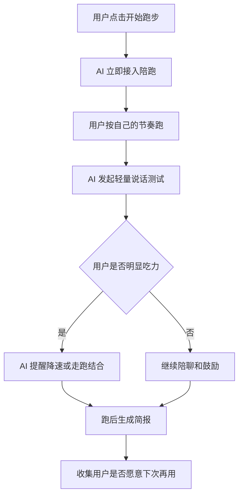

# 跑步聊天 需求孵化 v0.1

> 项目名称: 跑步聊天  
> 产品方向: AI + 真人混合式二区语音陪跑  
> 版本: v0.1  
> 创建日期: 2026-06-14  
> 文档状态: 规划草稿，待调研验证

---

## 1. 一句话描述

跑步聊天是一个 AI + 真人混合式语音陪跑产品，让用户在任何时间、任何地点，都能边聊边跑在自己的健康强度里；有人合适就和真人聊，没人或聊不下去就由 AI 无缝接上。

---

## 2. 为什么做

### 2.1 背景问题

普通人跑步时经常被配速、距离、排行榜、打卡记录牵引，容易把跑步变成“越快越好、越累越有效”。但对大多数以健康、减脂、心肺提升、长期坚持为目标的人来说，更重要的是控制强度，而不是盲目冲速度。

二区心率跑步提供了一个更适合普通人的训练方向：跑得轻松、稳定、可持续。与此同时，“说话测试”是一个非常直观的强度判断方式：如果用户还能比较完整地说话，通常说明强度没有高到失控；如果已经喘到说不出话，说明可能跑得太猛。

### 2.2 核心机会

现有跑步产品多数强调记录和表现，例如配速、里程、路线、卡路里、PB、排名。它们更擅长告诉用户“你跑了什么”，但不一定能在用户跑步过程中帮助他判断“你现在是不是跑得太猛”。

跑步聊天的机会是：把“能不能说话”从一个经验判断，变成一个可产品化的陪跑系统。

### 2.3 产品洞察

传统跑步社交强调“同路线、同配速、同时间”，但健康跑步更需要“同状态”。每个人的二区心率和对应配速都不同，线下同跑很容易互相迁就，反而打乱自己的训练强度。

因此，真正要解决的不是“找一个和我跑得一样快的人”，而是：

> 当我想健康跑步时，谁能立刻陪我聊天，同时不打乱我的心率节奏？

---

## 3. 给谁做

### 3.1 第一目标用户

| 属性 | 描述 |
|------|------|
| 用户类型 | 城市普通跑步者 / 健康跑新手 / 恢复跑与减脂跑用户 |
| 年龄段 | 25-45 岁优先 |
| 跑步水平 | 非专业跑者，能连续慢跑或快走 20-60 分钟 |
| 核心目标 | 健康、减脂、心肺提升、长期坚持 |
| 当前困扰 | 容易跑快、跑累、跑崩；一个人跑无聊；很难找到合适跑步搭子 |
| 产品价值 | 陪他用更轻松、更安全、更可持续的强度完成跑步 |

### 3.2 典型用户画像

#### 用户 A：想健康减脂但总跑太快的人

- 有运动意愿，但不懂训练强度。
- 一跑步就看配速，容易和别人比较。
- 跑完很累，第二天不想继续。
- 需要一个实时提醒他“慢一点也有效”的陪跑系统。

#### 用户 B：一个人跑步太无聊的人

- 有跑步习惯，但坚持困难。
- 不一定需要强社交，只需要有人陪他说几句话。
- 希望打开就能跑，不想约人、不想等人。
- 适合 AI 陪跑作为默认体验。

#### 用户 C：想找跑友但很难同频的人

- 愿意和真人聊天，但很难找到合适跑友。
- 时间不固定，配速不一致，话题也不一定合拍。
- 需要“真人优先，AI 兜底”的混合陪跑体验。

### 3.3 暂不优先服务的用户

| 用户类型 | 暂不优先原因 |
|----------|--------------|
| 专业竞速跑者 | 他们更关注结构化训练、间歇、配速和比赛表现，需求不同 |
| 完全无运动基础用户 | 安全风险较高，需要更谨慎的健康筛查和入门方案 |
| 只想社交不想运动的人 | 容易把产品带偏成语音社交平台 |
| 需要医疗康复指导的人 | 涉及医疗建议和合规风险，MVP 阶段不覆盖 |

---

## 4. 先验证什么

MVP v0.1 不应该先验证“能不能做一个完整平台”，而应该验证以下核心假设。

### 4.1 核心假设

| 编号 | 假设 | 如果为真 | 如果为假 |
|------|------|----------|----------|
| H1 | 用户愿意在跑步时使用语音陪跑 | 产品有基础使用动机 | 语音陪跑方向需要重构 |
| H2 | 聊天能帮助用户感知并控制运动强度 | “跑步 + 说话测试”成立 | 需要回到纯心率提醒或教练模式 |
| H3 | AI 陪跑可以解决没人在线、聊不来、掉线问题 | AI 可以作为产品底座 | 必须优先做真人社区供给 |
| H4 | 用户接受真人和 AI 混合切换 | 混合式陪跑成立 | 需要拆成两个独立模式 |
| H5 | 用户更在意“跑得轻松可持续”，而不是“跑得快” | 健康跑定位成立 | 需要重新定位为训练或社交产品 |

### 4.2 第一优先级验证

第一版只验证一个最关键问题：

> 用户是否愿意在跑步时打开一个语音陪跑系统，并通过聊天让自己保持轻松可持续的跑步状态？

这个问题比“真人匹配是否精准”“AI 是否足够聪明”“心率算法是否完美”更靠前。因为如果用户根本不愿意跑步时开语音，这个产品的后续复杂能力都没有意义。

### 4.3 第二优先级验证

当用户愿意使用语音陪跑后，再验证：

- 用户更喜欢 AI 陪跑、真人陪跑，还是两者混合？
- 用户在什么情况下会从真人切回 AI？
- 用户是否认为聊天提醒比数字心率提醒更自然？
- 用户跑后是否愿意看“可聊天跑步时长”和“二区保持时间”？

---

## 5. 产品定位

### 5.1 不是做什么

跑步聊天不是一个单纯的跑步记录工具，也不是一个单纯的语音社交 App，更不是医疗诊断产品。

它不以 PB、排行榜和高强度训练为核心，也不鼓励用户为了数据表现而跑得更猛。

### 5.2 是做什么

跑步聊天是一个“低压力健康跑陪伴系统”：

- 用聊天帮助用户判断自己有没有跑太猛。
- 用 AI 解决随时可用和聊得来的问题。
- 用真人提供真实感和社交连接。
- 用心率和语音状态辅助用户保持自己的健康强度。

### 5.3 核心主张

> 不同配速，也能一起跑。  
> 真人有温度，AI 不掉线。  
> 只要还能聊天，就别急着加速。

---

## 6. 用户场景

### 6.1 场景一：下班后临时想跑

用户下班后突然想跑 30 分钟，但没有约跑友。打开 App 后，AI 立即接入，陪用户热身并开始轻松聊天。系统通过用户说话流畅度和心率变化提醒用户不要跑太快。

### 6.2 场景二：真人匹配成功

用户跑步过程中，系统发现另一位正在跑二区、话题偏好接近的人。用户选择接入真人语音。两人不需要同配速，也不需要同路线，各自按照自己的心率区间跑，只在语音里保持连接。

### 6.3 场景三：真人聊不下去

用户和真人聊了一会儿发现不合适，点击“回到 AI 陪跑”。AI 立即接上，继续按用户当前状态陪跑，不制造社交尴尬。

### 6.4 场景四：跑得太猛

用户开始喘得明显，说话变短，心率也升高。AI 用语音提示：“你现在有点急了，我们先把速度降下来，回到能完整说话的状态。”

---

## 7. MVP v0.1 范围

### 7.1 必须包含

| 功能 | 目标 | 说明 |
|------|------|------|
| 开始一次跑步 | 建立跑步会话 | 用户点击后进入跑步陪伴状态 |
| AI 语音陪跑 | 保证随时可用 | 不依赖真人在线即可开始 |
| 轻量说话测试 | 验证聊天控强度 | 每隔一段时间引导用户说一句话 |
| 手动强度反馈 | 替代复杂算法 | 用户可选择“轻松 / 有点喘 / 太累” |
| 跑后报告 | 回收验证数据 | 记录陪跑时长、反馈次数、完成感 |

### 7.2 可以延后

| 功能 | 延后原因 |
|------|----------|
| 真人实时匹配 | 冷启动复杂，先验证语音陪跑需求 |
| 心率设备接入 | 设备兼容复杂，先用手动反馈 + 手机传感器占位 |
| 喘息自动识别 | 技术不确定性高，调研后再做 |
| 完整社区系统 | 容易偏离健康跑核心 |
| 付费系统 | 先验证留存和使用价值 |

### 7.3 建议的 MVP 顺序

---

## 8. 成功指标

### 8.1 MVP 验证指标

| 指标 | 目标含义 | v0.1 参考目标 |
|------|----------|---------------|
| 启动率 | 用户是否愿意开始一次语音陪跑 | 访问用户中 30% 点击开始 |
| 完成率 | 用户是否能跑完一次陪跑 | 开始用户中 50% 完成 15 分钟以上 |
| 语音参与率 | 用户是否愿意回应 AI | 开始用户中 40% 完成至少 3 次回应 |
| 主观有效率 | 用户是否觉得它帮自己控制强度 | 跑后问卷中 60% 选择有帮助 |
| 次日/三日复用意愿 | 是否有持续价值 | 跑后 50% 选择愿意下次再用 |

### 8.2 不作为 v0.1 成败指标

- 真人匹配成功率。
- 付费转化率。
- 大规模社交活跃度。
- 精准心率区间识别。
- 专业训练效果提升。

---

## 9. 风险与边界

### 9.1 安全风险

跑步产品不能暗示自己能避免猝死或替代医疗建议。产品需要明确提示：如果用户出现胸痛、头晕、异常心悸、呼吸困难、晕厥等情况，应立即停止运动并寻求专业帮助。

### 9.2 隐私风险

语音、心率、运动轨迹都属于敏感数据。MVP 阶段应尽量减少采集，优先本地处理或只采集必要数据，并明确告知用户数据用途。

### 9.3 社交风险

真人语音可能出现骚扰、尴尬、话题不适等问题。因此真人功能必须有一键退出、举报、屏蔽和 AI 兜底机制。

### 9.4 产品跑偏风险

如果过早强化社交，产品可能变成“跑步语音聊天室”；如果过早强化数据，产品可能变成普通运动记录工具。MVP 必须围绕“聊天帮助控制强度”这个核心。

---

## 10. 当前结论

### 10.1 为什么做

因为普通人需要一种更自然、更低压力、更容易坚持的健康跑方式。现有产品强调记录和表现，但缺少一个能在跑步过程中陪用户控制强度的实时系统。

### 10.2 给谁做

先给“想健康跑、容易跑太猛、一个人跑无聊、又很难找到合适跑友”的普通城市跑步者做，而不是先给专业跑者或纯社交用户做。

### 10.3 先验证什么

先验证用户是否愿意在跑步时使用 AI 语音陪跑，并通过聊天/说话测试来帮助自己保持轻松、可持续的跑步状态。

---

## 11. 下一步调研问题

1. 说话测试与运动强度之间有哪些权威依据？
2. 二区心率对普通健康跑用户的价值和误区是什么？
3. 现有跑步 App 是否已经做过 AI 陪跑、语音陪跑或心率语音提醒？
4. 用户跑步时是否真的愿意说话？在哪些场景愿意，哪些场景抗拒？
5. AI 实时语音陪跑的技术成本、延迟、稳定性和隐私风险是什么？
6. 如果加入真人匹配，最小安全机制必须包含哪些？
7. MVP 阶段是否需要连接手表心率，还是先用手动反馈验证需求？

