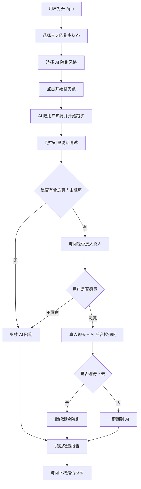

# 跑步聊天 产品形态与运营调研 v0.1

> 项目名称: 跑步聊天  
> 产品方向: AI + 真人混合式二区语音陪跑  
> 调研视角: 用户视角 + 运营视角 + 竞品启发  
> 创建日期: 2026-06-14  
> 文档状态: 调研草稿，待用户访谈验证

---

## 1. 调研结论先行

从用户角度看，跑步聊天不应该是一个“打开页面看数据”的产品，而应该是一个“戴上耳机就开始”的语音型跑步陪伴产品。

从运营角度看，跑步聊天也不应该一开始就做成“大型跑步社区”，而应该先做成“AI 兜底 + 小规模真人运营”的陪跑服务。第一阶段的运营重点不是追求 DAU，而是验证用户在跑步时是否真的愿意开语音、愿意回应、愿意复用。

因此，当前推荐产品形态是：

> 一个移动端语音陪跑产品，AI 默认在线，真人作为增强供给，跑中以耳机语音交互为主，跑后用轻量报告和群运营承接复用。

---

## 2. 外部调研摘要

### 2.1 运动强度与说话测试

CDC 对运动强度的说明支持“说话测试”：中等强度运动时通常可以说话但不能唱歌，高强度运动时往往只能说几句话就需要停下来换气。AHA 也给出了基于最大心率的目标心率区间，提示用户可以通过心率判断运动强度。

对我们的启发：

- “边跑边说话”不是纯噱头，有公共健康资料作为基础。
- 但我们不能宣称“能预防猝死”或“保证安全”，只能定位为强度感知和运动陪伴。
- 第一版应把“说话测试”做成体验语言，而不是医疗判断。

### 2.2 Nike Run Club

Nike Run Club 的官方页面强调随时随地开始跑、记录配速/距离/心率/分段、Live Location、挑战、训练计划和 Audio-Guided Runs。它的核心产品形态是“跑步记录 + 教练音频 + 社区挑战”。

对我们的启发：

- 用户已经被教育接受“耳机里的跑步教练”。
- NRC 的音频指导是预录内容或教练内容，不是实时互动聊天。
- 我们的差异点不应该是“也做语音指导”，而是“实时聊天 + 强度反馈 + AI/真人切换”。

### 2.3 Apple Fitness+ Time to Run

Apple Fitness+ Time to Run 是订阅制音频跑步体验，通过教练讲解、城市路线、音乐和 Apple Watch 数据结合，帮助用户保持动力。它证明大平台也在做“跑步中的音频陪伴”。

对我们的启发：

- 音频内容适合跑步场景，因为跑步时看屏幕不方便。
- Apple 做的是高质量内容订阅，不是实时陪聊。
- 我们不适合第一版重投入内容制作，而应依赖 AI 对话降低内容运营成本。

### 2.4 Strava

Strava 的强项是活动记录、运动数据、俱乐部、挑战和社交关系。官方支持文档显示，俱乐部可以按运动类型组织成员，有排行榜、动态 Feed、讨论通知等机制。Strava 新闻页也显示它持续扩展运动类型、社交分享、路线和训练数据能力。

对我们的启发：

- Strava 解决的是“跑完以后如何记录、展示、比较、连接”。
- 我们要解决的是“跑步过程中如何陪伴、控强度、不中断”。
- 跑后分享可以做，但不能让产品重心变成晒数据和排行榜。

### 2.5 Zombies, Run!

Zombies, Run! 通过故事音频、任务、敌人追逐、收集物和周更内容，把跑步变成沉浸式冒险。其官网显示有 1000 万级用户、500+ 任务、每周新内容、不同速度都可参与。

对我们的启发：

- “音频 + 跑步 + 沉浸感”长期成立。
- 但高质量剧情内容运营成本很高。
- 我们可以借鉴“陪伴感、任务感、连续性”，但不应第一版做重剧情。

### 2.6 Keep

Keep 官方强调海量运动课程、专业运动工具、社区好友、记录分享、商城和智能硬件。它是“内容 + 工具 + 社区 + 硬件/消费品”的综合运动平台。

对我们的启发：

- 中国用户已经熟悉“课程、工具、社区、硬件”的运动产品组合。
- 但综合平台容易选择太多、路径太重。
- 跑步聊天应避开大而全，先专注一个场景：低强度跑步中的语音陪伴。

### 2.7 跑步 App 动机研究

一项针对跑步追踪 App 的研究指出，跑步 App 常见能力包括运动记录、虚拟训练反馈、游戏/娱乐和社区分享；访谈研究也发现，跑步者的内在动机会受到目标设置、降低努力感、表现分享、认可、指导、信息和训练多样性影响。

对我们的启发：

- “降低努力感”和“陪伴分散注意力”是我们的核心机会。
- 不要只做提醒，要让用户觉得这次跑步更轻松、更容易完成。
- 运营不能只发排行榜，要围绕“完成一次轻松跑”给用户正反馈。

### 2.8 AI 运动反馈风险

2026 年一项关于 AI 运动反馈的研究分析了 Strava AI 功能相关讨论，指出用户会对 AI 反馈产生几类张力：数字评价和情境理解的冲突、单次总结和长期叙事的冲突、固定语气和不同情绪状态的冲突、单一 AI 声音和不同运动者类型的冲突。

对我们的启发：

- AI 不能像裁判一样评价用户，更应该像陪跑伙伴一样协商和提醒。
- AI 语气要允许用户选择：温柔陪伴、教练提醒、少说话、轻松闲聊。
- 跑后报告不要只打分，要保留用户主观感受。

---

## 3. 用户视角：产品应该长什么样

### 3.1 用户不是来“学习二区心率”的

用户真正想要的不是研究心率理论，而是：

- 今天能不能轻松跑完？
- 有没有人陪我跑？
- 我是不是跑太快了？
- 我跑完后有没有一点成就感？
- 下次我还愿不愿意再跑？

因此产品不应把首页做成专业运动仪表盘，而应把第一入口做成一个明确动作：

> 开始一次聊天跑。

### 3.2 跑中体验应该是语音优先

跑步时用户不方便看屏幕，也不适合频繁操作。核心交互应发生在耳机里：

- AI 主动开场：“我们今天先轻松跑 20 分钟。”
- 每隔几分钟发起轻量说话测试。
- 用户可用短句回应：“还行”“有点喘”“太快了”。
- AI 根据回应调整话术：“那我们慢一点，先找回能完整说话的节奏。”
- 如果真人接入，AI 退到后台，只做安全和节奏提醒。

### 3.3 用户需要“可退出”的社交

真人聊天的风险不是没人，而是用户怕尴尬、怕冒犯、怕聊不来。因此真人陪跑必须是弱绑定：

- 不默认强制真人连麦。
- 匹配前先显示对方标签：目标、跑步时长、话题偏好、说话频率。
- 接入后随时可以“回到 AI 陪跑”。
- 退出理由不需要告诉对方。
- AI 接回时不强调失败，只说“我们继续按你的节奏跑”。

### 3.4 用户需要低压力报告

跑后报告不应强化“你今天配速多快”，而应强化：

- 你完成了一次轻松跑。
- 你有多少时间处在可聊天状态。
- 你有几次及时降速。
- 你主观感受如何。
- 下次建议跑多久、用什么模式。

核心报告指标建议：

| 指标 | 用户语言 |
|------|----------|
| 陪跑完成时长 | 今天有人陪你跑了多久 |
| 可聊天时长 | 你保持轻松状态的时间 |
| 过喘提醒次数 | 你及时慢下来的次数 |
| 主观体感 | 轻松 / 有点喘 / 太累 |
| 下次建议 | 继续轻松跑 20 分钟 |

---

## 4. 运营视角：产品应该怎么跑起来

### 4.1 不要先做大社区，先做小闭环

冷启动阶段，如果一上来做真人匹配，会遇到四个运营难题：

- 在线人数不足，匹配失败。
- 匹配到了但配速和目标不一致。
- 两个人不一定聊得来。
- 语音社交安全和审核成本高。

因此运营上应先把 AI 做成稳定底座，再小范围引入真人。

推荐顺序：

1. AI 陪跑内测，验证跑中语音需求。
2. 微信群/社群招募种子用户，人工组织固定时段跑。
3. 半人工真人匹配，先做“约定时间的主题跑”。
4. 数据足够后，再做自动实时匹配。

### 4.2 运营不是运营“跑友”，而是运营“跑步场景”

如果只运营跑友关系，产品会变成普通社交；如果运营跑步场景，产品更容易形成习惯。

建议先运营以下场景：

| 场景 | 用户动机 | 产品模式 |
|------|----------|----------|
| 下班解压跑 | 放松、减压、不想太累 | AI 温柔陪跑 |
| 晨间唤醒跑 | 低压力启动一天 | AI 简短陪跑 + 群打卡 |
| 新手慢跑 | 怕跑崩、怕坚持不下去 | AI 说话测试 + 走跑建议 |
| 周末聊天跑 | 想找人说话 | 真人主题房 + AI 兜底 |
| 情绪陪伴跑 | 想边跑边整理心情 | AI 情绪陪跑 |

### 4.3 真人供给应从“主题房”开始，而不是随机匹配

第一版真人功能不建议直接做陌生人随机连麦。更适合的运营形式是：

- “20 分钟下班轻松跑”
- “新手不拼配速跑”
- “今天只聊轻松话题”
- “不尬聊，没人说话也可以”
- “女生友好慢跑房”
- “英语轻聊跑”

主题房比随机匹配更容易降低尴尬，因为用户知道为什么加入，也知道应该聊什么。

### 4.4 AI 也是运营资产

AI 不只是功能，也是可运营的“陪跑人设”。

可以设计几类 AI 陪跑员：

| AI 模式 | 适合用户 | 话术风格 |
|---------|----------|----------|
| 温柔陪伴型 | 下班、压力大、恢复跑 | 少评价，多安抚 |
| 轻教练型 | 想控制强度的新手 | 适度提醒，明确建议 |
| 少说话型 | 不想一直聊天的人 | 低频说话测试 |
| 闲聊型 | 一个人跑无聊的人 | 话题丰富，弱训练 |
| 情绪整理型 | 想边跑边复盘的人 | 提问式陪伴 |

运营可以根据用户复用率、完成率、主观评分持续优化不同 AI 人设。

### 4.5 核心运营数据

v0.1 不要先看 DAU 和付费，而要看能不能完成跑步闭环。

| 阶段 | 指标 | 判断问题 |
|------|------|----------|
| 开始前 | 开始陪跑点击率 | 用户是否被场景吸引 |
| 跑中 | 15 分钟完成率 | 产品是否能陪用户跑下去 |
| 跑中 | 用户回应次数 | 用户是否愿意跑中说话 |
| 跑中 | 切换/退出原因 | 真人或 AI 是否打扰用户 |
| 跑后 | 主观有帮助比例 | 用户是否感觉被帮助 |
| 跑后 | 下次预约/提醒开启率 | 是否有复用意愿 |
| 社群 | 打卡连续天数 | 是否形成习惯 |

---

## 5. 产品形态建议

### 5.1 v0.1：AI 语音陪跑验证版

目标：验证用户是否愿意跑步时开语音陪跑。

形态：

- 移动端优先。
- 首页只有一个强入口：开始聊天跑。
- AI 陪跑为默认模式。
- 用户可以选择陪跑风格。
- 跑中通过语音提示和按钮反馈完成说话测试。
- 跑后生成轻量报告。
- 运营通过微信群或小社群收集反馈。

不建议 v0.1 就做：

- 完整真人随机匹配。
- 复杂心率设备接入。
- 大社区 Feed。
- 排行榜。
- 重内容课程库。

### 5.2 v0.2：半运营真人主题跑

目标：验证真人陪跑是否带来更高完成率和复用率。

形态：

- 固定时段主题跑。
- 用户报名后进入主题房。
- 真人连麦前有话题和节奏偏好。
- AI 做后台节奏提醒和兜底。
- 用户可随时切回 AI。
- 跑后区分 AI 时长、真人时长和满意度。

### 5.3 v0.3：自动匹配 + 混合陪跑

目标：验证规模化真人匹配是否可行。

形态：

- 实时在线用户池。
- 按跑步目标、预计时长、说话频率、话题偏好、性别安全偏好匹配。
- AI 默认先陪跑，匹配成功后提示是否接入真人。
- 真人断开后 AI 无缝接回。
- 加入举报、屏蔽、评分和冷启动安全机制。

### 5.4 v1.0：健康跑陪伴网络

目标：形成可持续增长和商业化。

形态：

- AI 个性化陪跑伙伴。
- 真人主题房和固定跑步搭子。
- 心率设备接入和个体化强度区间。
- 跑后长期趋势报告。
- 社群挑战但不强调速度排名。
- 会员订阅、教练合作、品牌活动等商业化。

---

## 6. 推荐的用户流程

---

## 7. 关键产品原则

### 7.1 语音第一，屏幕第二

跑中不要求用户盯屏幕，主要交互必须能通过耳机完成。

### 7.2 AI 先接住用户

用户点击开始后不能等待。AI 必须立即出现，真人匹配只能作为增强。

### 7.3 社交可选择、可退出、可兜底

真人聊天不能给用户制造负担。切回 AI 是正常能力，不是失败。

### 7.4 不以速度崇拜为核心

产品鼓励轻松完成、稳定坚持、强度可控，不用排行榜刺激用户跑更快。

### 7.5 报告要支持自我感受

报告不是审判用户，而是帮助用户理解自己今天的状态。

---

## 8. 运营验证方案

### 8.1 第一批种子用户

建议招募 30-50 人，优先来自：

- 有跑步习惯但不专业的人。
- 减脂、恢复跑、健康跑人群。
- 下班后或晨间有固定运动意愿的人。
- 愿意接受 AI 语音陪伴的人。

暂不优先：

- 追求 PB 的竞速型跑者。
- 完全无运动基础且有健康风险的人。
- 只想语音交友的人。

### 8.2 第一轮运营实验

| 实验 | 目标 | 方式 | 成功信号 |
|------|------|------|----------|
| AI 陪跑实验 | 验证跑中语音接受度 | 让用户完成 3 次 AI 陪跑 | 50% 用户完成 2 次以上 |
| 主题房实验 | 验证真人价值 | 固定时段组织 20 分钟主题跑 | 真人房完成率高于 AI 单跑 |
| 退出实验 | 验证切 AI 是否必要 | 记录真人切回 AI 原因 | 用户认为切换自然、不尴尬 |
| 报告实验 | 验证复用动机 | 跑后给轻量报告和下次建议 | 40% 用户愿意设置下次提醒 |

### 8.3 需要访谈的问题

跑前：

- 你为什么想跑步？
- 你跑步时最容易失败的原因是什么？
- 你跑步时愿意听别人说话吗？

跑中：

- AI 说话频率是太多还是太少？
- 你愿意回应 AI 的问题吗？
- 什么情况下你会觉得被打扰？

跑后：

- 你觉得它帮你跑得更轻松了吗？
- 你会下次继续用吗？
- 你更想 AI 陪、真人陪，还是两者结合？

---

## 9. 当前判断

### 9.1 最可能成立的产品形态

最可能成立的是：

> AI 默认陪跑 + 真人主题房增强 + 跑后轻量报告 + 小社群运营。

这比“纯 AI 跑步教练”更有人味，也比“纯真人跑步社交”更稳定。

### 9.2 最需要避免的产品形态

需要避免：

- 做成普通跑步记录工具。
- 做成陌生人语音聊天室。
- 做成专业训练计划 App。
- 做成重内容课程平台。
- 过早追求手表、算法、社区、商业化的大而全。

### 9.3 MVP 的形态建议

v0.1 应该非常克制：

1. 用户点击开始聊天跑。
2. AI 立即接入。
3. 跑中通过说话测试和主观反馈控制强度。
4. 跑后生成“轻松完成报告”。
5. 运营通过社群收集体验反馈。

真人功能可以在 v0.2 用“固定时段主题跑”验证，不建议 v0.1 就直接做自动随机匹配。

---

## 10. 参考来源

- CDC: [How to Measure Physical Activity Intensity](https://www.cdc.gov/physical-activity-basics/measuring/index.html)
- American Heart Association: [Target Heart Rates Chart](https://www.heart.org/en/healthy-living/exercise-and-physical-activity/fitness-basics/target-heart-rates)
- Nike: [Nike Run Club App](https://www.nike.com/nrc-app)
- Apple Newsroom: [Apple Fitness+ introduces Time to Run](https://www.apple.com/newsroom/2022/01/apple-fitness-plus-introduces-collections-and-time-to-run-starting-january-10/)
- Strava Support: [Clubs on Strava](https://support.strava.com/hc/en-us/articles/216918347-Clubs-on-Strava)
- Strava Press: [Strava Newsroom](https://press.strava.com/)
- Zombies, Run!: [Official Site](https://zombiesrungame.com/)
- Keep: [Official Site](https://www.gotokeep.com/)
- Gute, Schloegl, Groth: [Keep on Running! Running App Motivation Study](https://arxiv.org/abs/2206.09613)
- Shalawadi et al.: [Who Gets to Interpret the Workout? AI Fitness Feedback Study](https://arxiv.org/abs/2604.23830)

