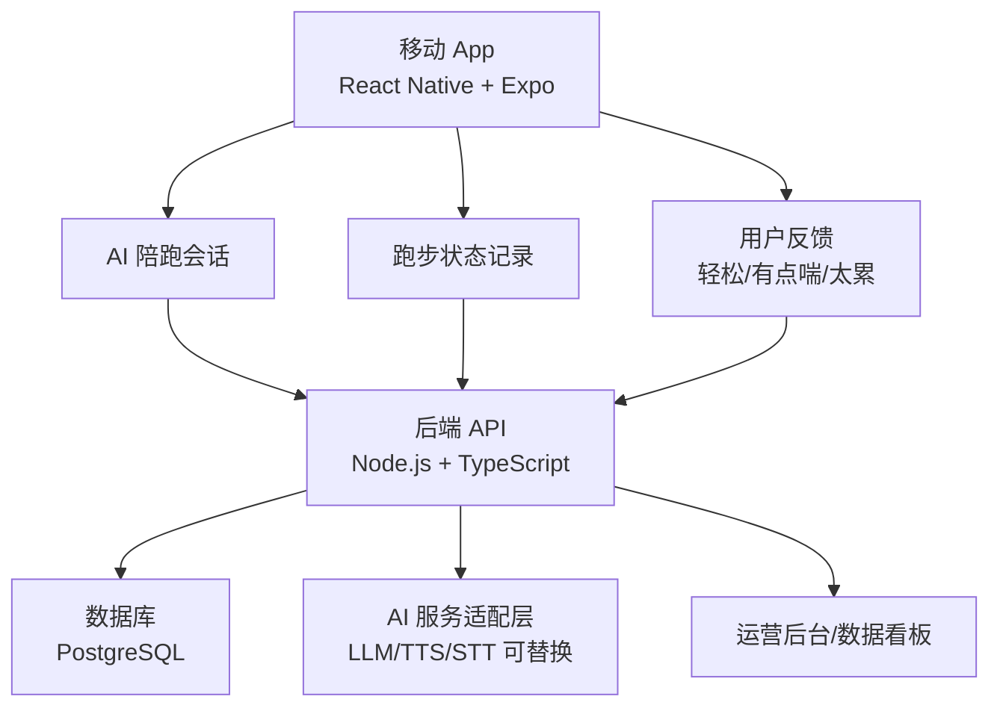
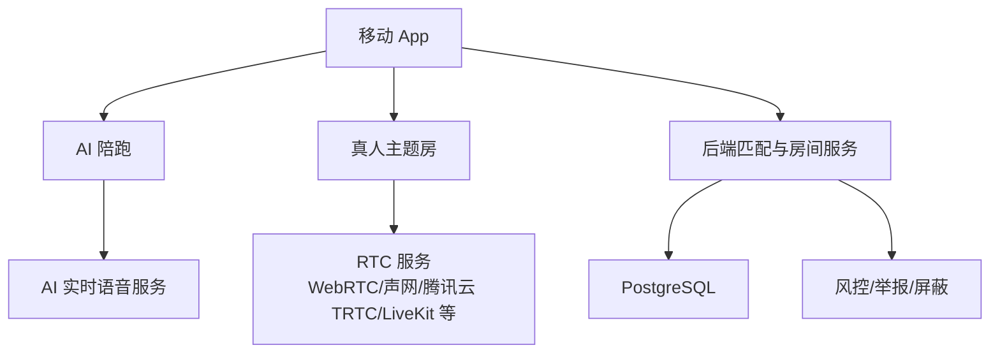
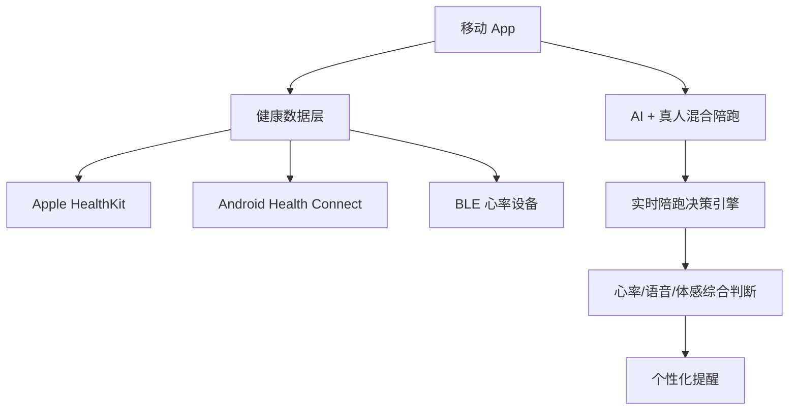

# 跑步聊天 技术平台选择 v0.1

> 项目名称: 跑步聊天  
> 主题: 开发平台与技术路线选择  
> 创建日期: 2026-06-14  
> 文档状态: 技术预研草稿，待 MVP 范围确认

---

## 1. 结论先行

推荐第一阶段做：

> 移动 App 优先，使用 React Native + Expo + TypeScript 开发；iOS 和 Android 同时保留，但 v0.1 可以先从 iOS TestFlight 或内部 Android APK 小范围验证开始。

不推荐第一阶段把主体验做在 Web / H5 / 小程序里。它们适合做官网、招募页、活动报名、跑后报告分享，但不适合作为跑中核心体验。

原因很简单：跑步聊天的核心场景发生在“手机锁屏、戴耳机、后台播放/录音、可能需要 GPS、未来还要接心率和手表数据”的环境里。这类能力天然更适合原生移动 App。

---

## 2. 产品能力对平台的要求

跑步聊天不是普通内容 App，它至少需要这些能力：

| 能力 | 对平台的要求 | 重要性 |
|------|--------------|--------|
| 跑中语音陪伴 | 后台音频播放、耳机控制、音频中断处理 | P0 |
| 用户说话测试 | 麦克风权限、短语音采集、语音识别或手动反馈 | P0 |
| 跑步会话 | 屏幕锁定后仍能继续计时、记录状态 | P0 |
| 安全提醒 | 实时提示、震动/语音反馈 | P0 |
| 跑后报告 | 本地数据 + 服务端数据记录 | P0 |
| 真人语音房 | WebRTC/RTC 能力、弱网处理、断线重连 | P1 |
| 心率数据 | Apple HealthKit、Android Health Connect、BLE 或手表生态 | P1/P2 |
| 运动轨迹 | GPS、后台定位、隐私授权 | P2 |
| 社群运营 | 分享、邀请、活动报名 | P2 |

结论：主体验应该放在移动 App；Web 和小程序只做增长和运营承接。

---

## 3. 平台选项对比

### 3.1 原生 iOS + Android

| 维度 | 判断 |
|------|------|
| 优点 | 对 HealthKit、Health Connect、后台音频、定位、蓝牙、手表支持最好 |
| 缺点 | 需要 Swift + Kotlin 两套开发，MVP 成本高，迭代慢 |
| 适合阶段 | v1.0 后，如果健康数据和设备能力成为核心壁垒 |

不建议第一版直接双原生。我们现在最重要的是验证用户是否愿意使用语音陪跑，而不是一开始把设备生态做到极致。

### 3.2 React Native + Expo

| 维度 | 判断 |
|------|------|
| 优点 | 一套 TypeScript 代码覆盖 iOS/Android；迭代快；和后端/AI 工程栈统一；可以通过 Expo Development Build 和 Config Plugin 接入原生能力 |
| 缺点 | 遇到复杂 HealthKit、Health Connect、蓝牙、后台任务时，可能需要写原生模块或切到裸工作流 |
| 适合阶段 | v0.1 到 v0.3，最推荐 |

推荐它作为主路线。Expo 官方文档说明它可以用一个 JavaScript/TypeScript 项目构建跨 Android、iOS 和 Web 的应用；Expo Audio 也提供音频播放和录音能力，并支持通过配置开启后台播放/录音相关原生设置。

### 3.3 Flutter

| 维度 | 判断 |
|------|------|
| 优点 | 跨平台 UI 稳定，性能好，适合复杂动效和多端一致视觉 |
| 缺点 | 需要 Dart 技术栈；AI/实时语音/服务端 TypeScript 生态衔接不如 React Native 自然 |
| 适合阶段 | 如果团队更熟 Flutter，可以选；否则不是当前最优 |

Flutter 是可行方案，但这个产品的核心难点不在 UI 渲染，而在语音、实时、AI、运营实验和快速迭代。React Native + TypeScript 更适合当前阶段。

### 3.4 Web / PWA

| 维度 | 判断 |
|------|------|
| 优点 | 开发快，分发快，适合落地页、问卷、活动报名、跑后报告分享 |
| 缺点 | 后台能力、蓝牙、健康数据、系统权限、锁屏体验不稳定 |
| 适合阶段 | 增长和运营辅助，不做主跑步体验 |

MDN 对 Web Bluetooth 的说明显示它不是 Baseline，并且仍属于实验技术，部分主流浏览器不可用。因此不能把未来心率设备能力押在 Web 上。

### 3.5 微信小程序

| 维度 | 判断 |
|------|------|
| 优点 | 中国市场获客方便，适合活动报名、社群打卡、跑后报告传播 |
| 缺点 | 跑中后台语音、长时间录音、健康数据、手表/蓝牙、锁屏体验都不是它的强项 |
| 适合阶段 | 运营入口，不做主体验 |

如果目标市场在中国，小程序可以做“跑步聊天活动页”和“主题跑报名页”，但不要把第一版主产品做成小程序。

### 3.6 Apple Watch / Wear OS

| 维度 | 判断 |
|------|------|
| 优点 | 最适合实时心率、运动状态和手腕提醒 |
| 缺点 | 开发成本高，用户设备覆盖有限，App 审核和健康数据权限更复杂 |
| 适合阶段 | v1.0 后增强，不做第一入口 |

第一版先用手机验证“语音陪跑需求”。如果数据证明用户愿意用，再接手表。

---

## 4. 推荐架构

### 4.1 v0.1 技术架构

v0.1 不强依赖实时真人语音，也不强依赖手表心率。先用 AI 语音陪跑、轻量说话测试和手动体感反馈验证需求。

### 4.2 v0.2 技术架构

v0.2 开始加入真人主题房，但建议先用半运营方式，不急着做全自动随机匹配。

### 4.3 v0.3+ 技术架构

v0.3 以后再做心率设备和自动化强度判断，避免第一版被设备兼容拖慢。

---

## 5. MVP 开发范围建议

### 5.1 v0.1 必须做

| 模块 | 技术实现 |
|------|----------|
| App 主流程 | React Native + Expo |
| 开始聊天跑 | 本地状态 + 后端创建 session |
| AI 陪跑 | 后端 AI 服务适配层，前端播放语音或文字转语音 |
| 说话测试 | 先用按钮/短语音反馈，不做复杂喘息识别 |
| 跑步计时 | App 本地计时 + session 记录 |
| 跑后报告 | 后端生成摘要，前端展示 |
| 数据埋点 | 记录开始、完成、退出、反馈、复用意愿 |

### 5.2 v0.1 暂不做

| 暂不做 | 原因 |
|--------|------|
| 自动真人匹配 | 冷启动和风控成本高 |
| 手表心率接入 | 设备兼容复杂，不是第一验证点 |
| BLE 心率带 | Web/跨平台兼容和连接稳定性复杂 |
| 长时间后台录音 | 隐私、审核、耗电、合规风险高 |
| 复杂 AI 喘息识别 | 技术不确定，先用主观反馈验证价值 |
| 排行榜/社区 Feed | 会把产品带向速度焦虑和泛社交 |

---

## 6. 具体技术栈建议

### 6.1 前端 App

| 层 | 推荐 |
|----|------|
| 框架 | React Native + Expo |
| 语言 | TypeScript |
| 路由 | Expo Router |
| 音频 | Expo Audio；必要时接原生 RTC SDK |
| 状态管理 | Zustand 或轻量 Context，先不过度工程化 |
| 本地存储 | SQLite / SecureStore / AsyncStorage，按数据敏感程度选择 |
| 分发 | iOS TestFlight、Android 内测 APK / Google Play Internal Testing |

### 6.2 后端

| 层 | 推荐 |
|----|------|
| 语言 | TypeScript |
| 服务 | Node.js，Fastify / NestJS 二选一 |
| 数据库 | PostgreSQL |
| 缓存/队列 | v0.1 可不做；v0.2 引入 Redis |
| 实时通道 | v0.1 WebSocket 可选；v0.2 引入 RTC |
| AI 接入 | 做成 Provider Adapter，避免绑定单一模型供应商 |
| 文件存储 | 仅在必要时存短音频；默认不长期保存原始语音 |

### 6.3 运营后台

v0.1 不需要重后台，可以先做最小数据表 + 简单看板：

- 用户数
- 开始跑步次数
- 15 分钟完成率
- 跑中反馈次数
- 退出原因
- 跑后满意度
- 下次复用意愿

如果要快速做后台，可以用 Retool / Supabase Studio / 自建简单 Admin 页面，不要先做复杂 CRM。

---

## 7. 为什么不是先做 Web

Web 最大的问题不是做不出来，而是跑步主场景不稳定：

- 用户跑步时经常锁屏。
- 语音陪跑需要稳定后台播放。
- 说话测试可能需要麦克风权限。
- 真人聊天需要 RTC 和弱网处理。
- 未来心率可能要接 HealthKit、Health Connect 或 BLE。
- Web Bluetooth 在主流浏览器支持上存在限制，不能作为核心依赖。

所以 Web 应该承担：

- 官网
- 等候名单
- 用户访谈问卷
- 跑后报告分享页
- 主题跑报名页

而不是承担：

- 跑中主体验
- 实时语音陪跑
- 心率设备连接

---

## 8. 开发节奏建议

### 8.1 第 0 周：原型验证

- 不开发完整 App。
- 用 Figma/静态页面做流程。
- 用人工 AI 陪跑脚本模拟一次跑步体验。
- 找 5-10 个用户试跑。

### 8.2 第 1-2 周：技术 Spike

- Expo App 能否稳定播放语音。
- 锁屏后音频是否能持续。
- 用户跑中按钮反馈是否顺畅。
- 后端能否创建跑步 session 并生成跑后报告。
- AI 话术是否能按状态切换。

### 8.3 第 3-4 周：MVP v0.1

- 完成 App 主流程。
- 完成 AI 陪跑脚本/语音。
- 完成跑中反馈。
- 完成跑后报告。
- 完成基础埋点。
- 开始 30-50 人种子用户测试。

### 8.4 第 5 周以后：决定是否加真人

只有当 AI 陪跑数据成立后，再进入真人主题房：

- 如果 AI 陪跑完成率低，先优化 AI 体验。
- 如果用户明确表示想真人陪，再做主题房。
- 如果用户对语音陪跑本身抗拒，就不要急着做真人匹配。

---

## 9. 当前最终建议

我们应该把产品拆成三个平台层：

1. **主产品平台：移动 App**
   - React Native + Expo。
   - 承担跑中陪跑、反馈、报告。

2. **运营增长平台：Web / 小程序**
   - 承担招募、报名、分享、社群承接。
   - 不承担跑中核心体验。

3. **未来设备平台：Apple Watch / Wear OS / 心率设备**
   - 承担更精准心率和手腕提醒。
   - 在 v0.3 或 v1.0 后再做。

一句话：

> 第一版用移动 App 验证语音陪跑，用 Web/小程序做获客，用手表和心率设备留到产品价值被验证之后。

---

## 10. 参考来源

- React Native: [Introduction](https://reactnative.dev/docs/getting-started)
- Expo: [Documentation](https://docs.expo.dev/)
- Expo: [Audio SDK](https://docs.expo.dev/versions/latest/sdk/audio/)
- Expo: [Development Builds](https://docs.expo.dev/develop/development-builds/introduction/)
- Expo: [Config Plugins](https://docs.expo.dev/config-plugins/introduction/)
- Flutter: [Flutter Docs](https://docs.flutter.dev/)
- Apple Developer: [HealthKit](https://developer.apple.com/documentation/healthkit)
- Apple Developer: [HKWorkoutSession](https://developer.apple.com/documentation/healthkit/hkworkoutsession)
- Android Developers: [Health Connect](https://developer.android.com/health-and-fitness/health-connect)
- MDN: [Web Bluetooth API](https://developer.mozilla.org/en-US/docs/Web/API/Web_Bluetooth_API)
- MDN: [WebRTC API](https://developer.mozilla.org/en-US/docs/Web/API/WebRTC_API)

