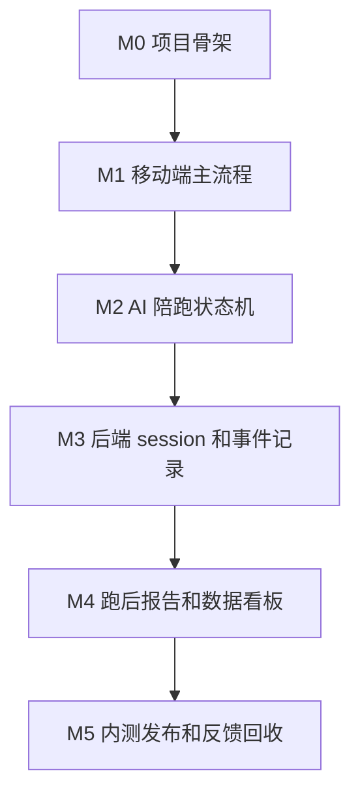

# 跑步聊天 MVP v0.1 开发任务清单

> 项目名称: 跑步聊天  
> 版本: MVP v0.1  
> 开发目标: 验证用户是否愿意在跑步时使用 AI 语音陪跑，并通过聊天/说话测试帮助自己保持轻松可持续的跑步状态  
> 技术路线: React Native + Expo + TypeScript，后端 Node.js + TypeScript  
> 创建日期: 2026-06-14  
> 文档状态: 待评审开发清单

---

## 0. 重要复盘：当前 v0.1 的 MVP 偏差

> 2026-06-15 Android APK 首轮体验后确认：当前实现更接近“点击式流程原型 / 技术冒烟包”，不能算真正验证“跑步时通过说话控制强度”的 MVP。

原始 MVP 要验证的是：用户跑步时是否愿意开口说话，App 是否能通过语音互动帮助用户保持轻松可持续的强度。

当前 v0.1 实际验证的是：用户能否通过按钮走通开始跑、跑中反馈、结束、报告的页面流程。

这两者存在明显偏差：

| 维度 | 原始目标 | 当前实现 | 结论 |
|------|----------|----------|------|
| 跑中输入 | 用户说话 | 用户点按钮 | 未验证核心假设 |
| AI 反馈依据 | 用户语音内容/说话状态 | 体感按钮 | 数据有效性不足 |
| 跑步场景适配 | 少看屏幕、少动手 | 跑中需要点按钮 | 场景不自然 |
| 报告价值 | 说话测试和强度控制 | 按钮统计 | 报告不匹配核心价值 |
| MVP 指标 | 语音互动率/说话测试有效率 | 点击反馈率 | 指标需要重定义 |

因此，本文档中的 v0.1 应重新定位为：

```text
v0.1 技术冒烟原型 / 点击式流程原型
```

真正的产品 MVP 应调整为：

```text
v0.2 语音优先聊天跑 MVP
```

详细复盘与 v0.2 纠偏方案见：`06-MVP-v0.1复盘与v0.2语音优先纠偏.md`。

v0.2 的正式假设验证文档和开发任务清单见：

- `07-MVP-v0.2二区说话测试假设验证.md`
- `08-MVP-v0.2开发任务清单.md`

---

## 1. v0.1 核心目标

MVP v0.1 不追求完整平台，只验证一个核心闭环：

> 用户点击开始聊天跑，AI 立即陪跑；跑中通过语音提示和主观反馈判断强度；跑后生成轻量报告，并收集用户是否愿意下次继续使用。

### 1.1 成功标准

| 指标 | 验证问题 | 目标 |
|------|----------|------|
| 开始陪跑点击率 | 用户是否愿意尝试 | 访问用户中 30% 点击开始 |
| 15 分钟完成率 | 产品是否能陪用户跑下去 | 开始用户中 50% 完成 15 分钟以上 |
| 跑中反馈率 | 用户是否愿意跑中互动 | 开始用户中 40% 完成至少 3 次反馈 |
| 主观有效率 | 用户是否觉得有帮助 | 跑后 60% 选择有帮助 |
| 复用意愿 | 是否值得继续做 | 跑后 50% 选择愿意下次再用 |

---

## 2. v0.1 产品范围

### 2.1 本版本做

| 模块 | 功能 | 优先级 |
|------|------|--------|
| 移动 App | 首页、开始跑步、跑中陪跑、跑后报告 | P0 |
| AI 陪跑 | 预设陪跑风格、跑中提示、说话测试、降速提醒 | P0 |
| 反馈系统 | 轻松 / 有点喘 / 太累 / 想安静一会儿 | P0 |
| 数据记录 | 跑步 session、跑中事件、退出原因、跑后评价 | P0 |
| 后端 API | 创建 session、记录事件、生成报告、导出数据 | P0 |
| 安全与隐私 | 运动风险提示、隐私说明、非医疗声明 | P0 |
| 内测发布 | iOS TestFlight 或 Android 内测包 | P0 |

### 2.2 本版本不做

| 暂不做 | 原因 |
|--------|------|
| 真人随机匹配 | 冷启动和风控成本高，v0.2 再验证 |
| 真人语音房 | 先验证 AI 陪跑需求，不引入 RTC 复杂度 |
| 手表心率接入 | 设备兼容复杂，不是第一验证点 |
| 自动喘息识别 | 技术不确定，先用主观反馈替代 |
| 长时间后台录音 | 隐私、审核、耗电、合规风险高 |
| 排行榜和社区 Feed | 容易把产品带偏到速度焦虑和泛社交 |
| 付费系统 | 先验证使用价值和复用意愿 |

---

## 3. 推荐开发里程碑

### Milestone 0：项目骨架与规范

目标：把可持续开发的工程基础搭起来。

- [ ] 创建代码仓库结构
- [ ] 创建移动端 Expo App
- [ ] 创建后端 API 服务
- [ ] 配置 TypeScript、Lint、Format、测试脚本
- [ ] 配置环境变量管理
- [ ] 建立基础 README 和启动说明
- [ ] 建立基础数据模型草案

验收标准：

- 开发者可以本地启动移动端和后端。
- 基础 lint/test 命令可以运行。
- 项目目录清晰，后续功能有明确放置位置。

---

### Milestone 1：移动端主流程

目标：用户可以完整走通“开始跑步 -> 跑中 -> 结束 -> 报告”的前端流程。

- [ ] 首页：展示产品主张和“开始聊天跑”按钮
- [ ] 跑前页：选择今日状态，例如轻松跑、下班解压、新手慢跑
- [ ] 陪跑风格选择：温柔陪伴 / 轻教练 / 少说话
- [ ] 安全提示页：展示非医疗声明和异常症状提醒
- [ ] 跑中页：计时器、当前陪跑模式、反馈按钮、结束按钮
- [ ] 跑中反馈按钮：轻松 / 有点喘 / 太累 / 想安静一会儿
- [ ] 暂停/继续/结束跑步流程
- [ ] 跑后报告页：展示本次陪跑时长、反馈次数、体感总结、下次建议
- [ ] 跑后问卷：是否有帮助、是否愿意下次继续

验收标准：

- 不接后端也能用 mock 数据跑通完整流程。
- 跑中页面在手机上操作足够大、足够简单。
- 用户无需阅读复杂说明即可开始一次陪跑。

---

### Milestone 2：AI 陪跑最小闭环

目标：AI 能在跑中按节奏陪伴用户，并根据反馈调整提示。

- [ ] 定义 AI 陪跑状态机：热身、稳定跑、说话测试、降速提醒、安静模式、结束总结
- [ ] 编写三套陪跑脚本：温柔陪伴、轻教练、少说话
- [ ] 实现跑中定时提示，例如每 3-5 分钟触发一次说话测试
- [ ] 用户反馈“有点喘”时，AI 提醒降速
- [ ] 用户反馈“太累”时，AI 建议慢走、暂停或结束
- [ ] 用户选择“想安静一会儿”时，AI 降低说话频率
- [ ] 添加安全兜底话术：胸痛、头晕、异常心悸等情况立即停止运动
- [ ] 接入设备 TTS 或音频播放方案

验收标准：

- AI 提示不是随机闲聊，而是和跑步状态相关。
- 用户反馈后，下一句提示能明显改变。
- AI 不做医疗诊断，不承诺避免风险。

---

### Milestone 3：后端 API 与数据记录

目标：记录用户使用行为，为后续“拿数据说话”提供基础。

- [ ] 创建匿名用户或轻量登录机制
- [ ] 创建跑步 session API
- [ ] 记录 session 开始、暂停、继续、结束
- [ ] 记录跑中反馈事件
- [ ] 记录 AI 提示触发事件
- [ ] 记录退出原因
- [ ] 记录跑后问卷
- [ ] 生成跑后报告 API
- [ ] 提供内测数据导出能力

建议 API：

| Method | Path | 用途 |
|--------|------|------|
| POST | `/api/sessions` | 创建跑步 session |
| PATCH | `/api/sessions/:id` | 更新 session 状态 |
| POST | `/api/sessions/:id/events` | 记录跑中事件 |
| POST | `/api/sessions/:id/feedback` | 提交跑后问卷 |
| GET | `/api/sessions/:id/report` | 获取跑后报告 |
| GET | `/api/admin/metrics` | 查看内测核心指标 |

验收标准：

- 每次跑步都有完整 session 记录。
- 能统计开始次数、完成次数、反馈次数、退出原因。
- 能导出种子用户测试数据。

---

### Milestone 4：跑后报告与运营数据

目标：让用户有正反馈，让团队能判断产品是否值得继续。

- [ ] 生成跑后报告文案
- [ ] 展示本次陪跑时长
- [ ] 展示跑中反馈统计
- [ ] 展示“你有几次及时慢下来”
- [ ] 展示主观体感总结
- [ ] 给出下次建议，例如继续轻松跑 20 分钟
- [ ] 收集跑后满意度
- [ ] 收集复用意愿
- [ ] 生成运营看板指标

验收标准：

- 用户跑完后知道自己完成了什么。
- 报告不制造配速焦虑。
- 团队能看到 MVP 成功标准对应的数据。

---

### Milestone 5：内测发布与反馈回收

目标：让 30-50 个种子用户完成真实试跑。

- [ ] 准备 iOS TestFlight 或 Android 内测包
- [ ] 准备用户招募文案
- [ ] 准备安全提醒和使用说明
- [ ] 建立内测微信群或反馈渠道
- [ ] 准备跑后访谈问题
- [ ] 设计 3 次试跑任务：首次体验、15 分钟轻松跑、下班解压跑
- [ ] 收集定量数据和定性反馈
- [ ] 输出内测复盘报告

验收标准：

- 至少 30 位种子用户安装或打开体验。
- 至少 15 位用户完成一次 15 分钟以上陪跑。
- 有足够反馈判断 v0.2 是否加入真人主题房。

---

## 4. 建议项目结构

```text
apps/
  mobile/                 # React Native + Expo App
  api/                    # Node.js + TypeScript 后端
packages/
  shared/                 # 共享类型、常量、校验规则
prd/
  P001-跑步聊天/           # 产品规划和 PRD 文档
```

### 4.1 移动端目录建议

```text
apps/mobile/
  app/
    index.tsx             # 首页
    pre-run.tsx           # 跑前选择
    run-session.tsx       # 跑中陪跑
    report.tsx            # 跑后报告
    settings.tsx          # 设置与隐私
  src/
    components/
    features/run/
    features/coach/
    features/report/
    lib/api/
    lib/audio/
    store/
```

### 4.2 后端目录建议

```text
apps/api/
  src/
    modules/sessions/
    modules/events/
    modules/coach/
    modules/reports/
    modules/admin/
    db/
    server.ts
```

---

## 5. 数据模型草案

### 5.1 User

| 字段 | 说明 |
|------|------|
| id | 用户 ID |
| nickname | 可选昵称 |
| createdAt | 创建时间 |
| testerGroup | 内测分组 |

### 5.2 RunSession

| 字段 | 说明 |
|------|------|
| id | 跑步会话 ID |
| userId | 用户 ID |
| mode | 下班解压 / 新手慢跑 / 轻松跑 |
| coachStyle | 温柔陪伴 / 轻教练 / 少说话 |
| status | active / paused / completed / abandoned |
| startedAt | 开始时间 |
| endedAt | 结束时间 |
| durationSec | 持续时长 |

### 5.3 RunEvent

| 字段 | 说明 |
|------|------|
| id | 事件 ID |
| sessionId | 跑步会话 ID |
| type | started / prompt / feedback / pause / resume / end |
| payload | 事件内容 |
| createdAt | 事件时间 |

### 5.4 PostRunFeedback

| 字段 | 说明 |
|------|------|
| id | 反馈 ID |
| sessionId | 跑步会话 ID |
| perceivedHelpfulness | 是否有帮助 |
| nextRunIntent | 是否愿意下次继续 |
| perceivedIntensity | 轻松 / 有点喘 / 太累 |
| comment | 文本反馈 |

---

## 6. AI 陪跑内容任务

### 6.1 必备话术包

- [ ] 开始跑步欢迎语
- [ ] 热身提醒
- [ ] 第一次说话测试
- [ ] 稳定跑鼓励
- [ ] 有点喘时的降速提醒
- [ ] 太累时的暂停/慢走建议
- [ ] 安静模式提示
- [ ] 异常症状安全提醒
- [ ] 结束跑步总结
- [ ] 下次跑步建议

### 6.2 AI 语气原则

- 不批评用户。
- 不追求更快配速。
- 不制造医疗承诺。
- 不替代医生建议。
- 不强迫用户说话。
- 用户反馈累时优先降强度，而不是鼓励硬撑。

---

## 7. 测试任务

### 7.1 功能测试

- [ ] 首次打开 App
- [ ] 开始跑步
- [ ] 跑中计时
- [ ] 跑中反馈
- [ ] 暂停和继续
- [ ] 结束跑步
- [ ] 查看报告
- [ ] 提交跑后问卷
- [ ] 网络异常时本地兜底
- [ ] 后端恢复后数据同步

### 7.2 场景测试

- [ ] 用户刚开始跑就退出
- [ ] 用户跑 15 分钟后正常结束
- [ ] 用户多次反馈“有点喘”
- [ ] 用户反馈“太累”
- [ ] 用户进入安静模式
- [ ] 用户跳过跑后问卷
- [ ] 用户重复跑第二次

### 7.3 安全测试

- [ ] 安全提示是否足够明确
- [ ] AI 是否避免医疗诊断
- [ ] 是否提示异常症状应停止运动
- [ ] 是否避免鼓励用户硬撑
- [ ] 隐私说明是否明确语音和运动数据用途

---

## 8. 开发顺序建议



建议先用 mock 数据把 App 流程跑通，再接后端。不要先陷入 AI 实时语音和设备心率接入。

---

## 9. v0.1 开发完成定义

v0.1 完成不是指功能很多，而是满足以下条件：

- 用户可以开始一次 AI 陪跑。
- 用户可以在跑中收到语音或文字提示。
- 用户可以反馈当前强度。
- AI 能根据反馈改变提醒。
- 用户可以结束跑步并看到报告。
- 系统能记录核心行为数据。
- 团队能用数据判断是否进入 v0.2 真人主题房。

---

## 10. 进入 v0.2 的判断条件

只有满足以下条件，才建议开发真人主题房：

- 至少 30 位种子用户完成真实试跑。
- 15 分钟完成率达到 50% 以上。
- 跑中反馈率达到 40% 以上。
- 跑后主观有效率达到 60% 以上。
- 用户访谈中明确出现“如果能有人一起聊会更好”的需求。

如果这些条件不成立，v0.2 应优先优化 AI 陪跑，而不是做真人匹配。
