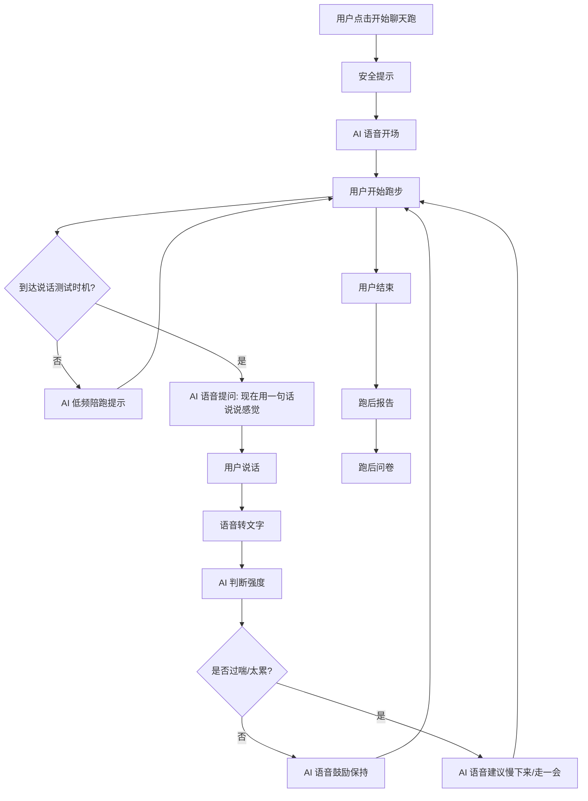

# 跑步聊天 MVP v0.1 复盘与 v0.2 语音优先纠偏

> 创建日期: 2026-06-15  
> 背景: Android APK 首轮模拟器体验后，发现当前版本偏离产品最核心假设  
> 结论: 当前 v0.1 只能作为“点击式流程原型 / 技术冒烟包”，不能作为真正验证“跑步时通过说话控制强度”的 MVP
> 后续规划: v0.2 的假设验证和任务拆解已沉淀到 `07-MVP-v0.2二区说话测试假设验证.md` 和 `08-MVP-v0.2开发任务清单.md`

---

## 1. 核心结论

这次 APK 跑下来暴露了一个关键规划问题：

> 我们原本要验证的是“用户跑步时，通过和 AI / 真人说话，判断自己是否处在轻松可持续的强度”；但当前版本让用户在跑步过程中点按钮反馈体感，这没有验证“边跑边说话”这个核心场景。

所以当前版本的真实价值不是产品验证，而是技术和流程验证：

| 当前 v0.1 实际验证了什么 | 是否有价值 | 说明 |
| --- | --- | --- |
| App 能安装、启动、出 APK | 有 | 技术冒烟价值 |
| 首页 -> 跑前 -> 安全提示 -> 跑中 -> 报告流程能跑通 | 有 | 流程原型价值 |
| API / 数据结构 / 报告结构初步可用 | 有 | 工程基础价值 |
| 用户是否愿意跑步时说话 | 没有验证 | 当前版本没有让用户说话 |
| AI 是否能通过用户说话判断强度 | 没有验证 | 当前版本没有语音输入、转写、语义判断 |
| 跑步过程中无手操作是否成立 | 没有验证 | 当前版本要求用户点按钮 |
| “聊天跑”是否比普通跑步 App 更有价值 | 没有验证 | 当前体验更像普通跑步记录 + 按钮反馈 |

当前版本不应继续被描述为“真正 MVP”，更准确的命名应该是：

```text
v0.1 技术冒烟原型 / 点击式流程原型
```

真正的 MVP 应从 v0.2 开始重做为：

```text
v0.2 语音优先聊天跑 MVP
```

---

## 2. 偏差说明：为什么当前版本不成立

### 2.1 产品原始假设

产品最初的核心假设是：

> 用户跑步时，如果还能自然说话，大概率说明强度没有过高；AI 或真人可以通过和用户说话，帮助用户保持轻松、有氧、可持续的跑步状态。

这里的关键不是“跑步 App”，而是：

1. 用户在跑步时真的开口说话。
2. App 能听到用户说话。
3. App 能根据用户说话的内容、长度、喘息感或主观描述给出反馈。
4. 用户不需要频繁看屏幕、点按钮。
5. 跑后报告能反映“说话测试”而不是“按钮点击”。

### 2.2 当前实现的实际行为

当前版本实际行为是：

1. 用户点击开始跑。
2. 跑中看屏幕。
3. 用户点击“轻松 / 有点喘 / 太累 / 安静一会儿”。
4. App 根据按钮更新 AI 文案。
5. 跑后报告统计按钮次数。

这套流程的问题是：

| 问题 | 影响 |
| --- | --- |
| 用户不需要说话 | 没有验证“聊天跑”是否成立 |
| 反馈来自按钮，不来自语音 | 数据不能代表真实说话测试 |
| 跑步时点按钮不自然 | 违背“跑步中低打扰”的场景 |
| AI 没有听用户说什么 | AI 陪跑变成固定脚本切换 |
| 报告统计按钮，不统计对话 | 报告和核心价值不匹配 |
| 运营指标会误导判断 | “跑中反馈率”不等于“语音互动率” |

### 2.3 当前测试用例的问题

当前测试用例强调：

- 按钮能不能点。
- 页面能不能跳转。
- 报告能不能生成。
- 离线提示是否合理。

这些测试对技术稳定性有用，但对产品验证价值有限。因为它们没有覆盖：

- 用户是否愿意跑步时开口说话。
- 用户说话后系统是否能回应。
- 用户是否觉得“被陪跑 / 被理解 / 被提醒慢下来”。
- 语音识别在跑步噪声场景是否可用。
- 语音交互是否比点击按钮更自然。

因此，当前测试用例应标记为：

```text
安装冒烟测试 / 流程冒烟测试
```

而不是：

```text
核心 MVP 验收测试
```

---

## 3. 重新定义 MVP：v0.2 必须语音优先

### 3.1 v0.2 核心验证问题

v0.2 不再验证“用户能否点按钮完成流程”，而是验证：

> 用户是否愿意在跑步时开口和 App 说话，并认为这种说话互动有助于控制跑步强度。

### 3.2 v0.2 产品原则

| 原则 | 说明 |
| --- | --- |
| 语音是主输入 | 跑中反馈必须主要来自用户说话，而不是按钮 |
| 屏幕是辅助 | 跑中页面只保留极少按钮，例如暂停、结束、紧急停止 |
| AI 必须回应用户说话 | 不再只是固定脚本播放 |
| 报告必须围绕说话测试 | 展示完成了几次说话测试、几次建议慢下来 |
| 点击反馈只能作为 fallback | 点击按钮可以保留，但不能作为核心验证指标 |
| 测试必须跑真实语音链路 | 不能只测 UI 跳转 |

---

## 4. v0.2 最小可行范围

### 4.1 必须做

| 模块 | 功能 | 优先级 | 说明 |
| --- | --- | --- | --- |
| 语音输入 | 跑中录音 / 按住说话 / 点击开始说话 | P0 | MVP 可先用 Push-to-Talk，降低后台录音和合规风险 |
| 语音转文字 | 将用户语音转成文字 | P0 | 可先接系统能力或云端 STT |
| AI 语音回应 | AI 根据用户话语生成回应 | P0 | 先支持短回应，不追求长对话 |
| TTS 播放 | 将 AI 回应读出来 | P0 | 用户跑步时不应看屏幕读字 |
| 说话测试 | 每隔一段时间要求用户说一句完整句子 | P0 | 例如“用一句话说说现在感觉怎么样” |
| 强度判断 | 根据用户表达判断轻松 / 有点喘 / 太累 | P0 | MVP 可先用语义规则 + 用户自述，不做喘息声学识别 |
| 跑中安全兜底 | 用户说胸痛、头晕等词时提示停止运动 | P0 | 不做医疗诊断，只做安全提醒 |
| 语音报告 | 报告展示语音互动次数、说话测试结果、降速提醒次数 | P0 | 报告不再只统计按钮 |
| 跑后问卷 | 询问语音陪跑是否有帮助 | P0 | 仍可用点击表单，因为跑后不是运动中 |

### 4.2 可以暂缓

| 暂缓项 | 原因 |
| --- | --- |
| 连续后台录音 | 隐私、耗电、审核和实现复杂度较高 |
| 喘息声学识别 | 技术风险高，不适合作为第一版核心依赖 |
| 真人匹配 | 先验证 AI 语音陪跑成立，再引入真人 |
| 心率设备接入 | 当前核心是说话测试，不是设备数据 |
| 长对话记忆 | MVP 先验证跑中短轮次互动 |
| 社区/排行榜 | 会偏离健康跑和轻松跑定位 |

---

## 5. v0.2 推荐交互流程



---

## 6. v0.2 成功指标重定义

当前 v0.1 的“跑中反馈率”必须废弃或降级，因为它统计的是按钮点击，不是说话互动。

### 6.1 新核心指标

| 指标 | 验证问题 | 目标 |
| --- | --- | --- |
| 语音开口率 | 用户是否愿意跑中开口 | 开始跑用户中 60% 至少完成 1 次语音回应 |
| 语音互动完成率 | 用户是否能完成多轮语音互动 | 开始跑用户中 40% 完成至少 3 次语音回应 |
| 说话测试有效率 | 用户是否觉得说话测试有帮助 | 跑后 60% 认为有助于控制强度 |
| 无手操作完成率 | 跑中是否可以少看屏幕 | 完成用户中 70% 不使用体感按钮完成主流程 |
| 降速提醒接受率 | AI 提醒慢下来是否被接受 | 被提醒用户中 50% 表示提醒有帮助 |
| STT 可用率 | 跑步噪声下语音识别是否可用 | 语音回应中 80% 能得到可读转写 |
| 15 分钟完成率 | 是否能陪用户跑下去 | 开始用户中 50% 完成 15 分钟以上 |
| 复用意愿 | 产品是否值得继续 | 跑后 50% 选择愿意下次再用 |

### 6.2 新埋点

| 事件 | 字段 | 说明 |
| --- | --- | --- |
| `voice_prompt_played` | promptId, elapsedSec | AI 发起说话测试 |
| `voice_record_started` | elapsedSec | 用户开始说话 |
| `voice_record_finished` | durationMs | 用户说话结束 |
| `stt_completed` | transcriptLength, confidence | 转写成功 |
| `stt_failed` | reason | 转写失败 |
| `intensity_inferred` | easy / breathless / tired / unknown | AI 判断强度 |
| `slowdown_cue_played` | reason | AI 提醒慢下来 |
| `manual_fallback_used` | buttonType | 用户仍使用了按钮 fallback |
| `voice_helpfulness_feedback` | yes / somewhat / no | 跑后评价语音是否有帮助 |

---

## 7. v0.2 测试验收标准

v0.2 的测试不能再以“点按钮”作为核心路径。核心验收必须包含：

### 7.1 必测用例

| 用例 | 正确结果 |
| --- | --- |
| 用户听到 AI 语音开场 | 手机外放或耳机能听到 AI 语音 |
| AI 发起说话测试 | App 用语音要求用户说一句话 |
| 用户说话后系统能转写 | 页面或日志能看到转写文本 |
| AI 根据用户说话回应 | 用户说“有点喘”后，AI 建议慢下来 |
| 用户说“还好，能完整说话” | AI 鼓励保持当前节奏 |
| 用户说“胸痛/头晕/不舒服” | AI 立即提示停止运动并寻求专业帮助 |
| 不点击体感按钮也能完成一次跑 | 报告页仍能生成语音互动统计 |
| 报告展示语音指标 | 展示语音回应次数、说话测试次数、降速提醒次数 |

### 7.2 v0.2 不通过条件

出现以下任一情况，不能认为 v0.2 MVP 成立：

1. 跑中主要反馈仍依赖按钮。
2. 用户不说话也能被记为“完成核心互动”。
3. 报告只统计按钮，不统计语音。
4. AI 回应和用户说话内容无关。
5. 语音识别失败后没有 fallback。
6. 安全风险词没有兜底提示。

---

## 8. 当前版本后续处理建议

### 8.1 当前 APK 的定位

当前 APK 保留，但只用于：

```text
安装冒烟、页面流程、报告样式、安全文案、EAS 出包链路
```

不要再用它判断：

```text
用户是否喜欢聊天跑
语音陪跑是否有效
说话测试是否能帮助控制强度
```

### 8.2 当前测试文档的标注

`APK_TEST_CASES.md` 应标注为：

```text
v0.1 点击式流程原型测试用例，不代表语音 MVP 验收。
```

### 8.3 下一步开发优先级

下一步不应该继续优化按钮流程，而应该立即进入语音 MVP：

1. 加入跑中 TTS 播放。
2. 加入最小语音输入：先做 Push-to-Talk 或点击录音。
3. 接入 STT 转写。
4. 根据转写内容做强度判断。
5. 生成语音互动报告。
6. 重新设计测试用例，要求用户跑中说话。

---

## 9. 多角色评审

### 产品评审

结论：当前版本偏离核心价值。按钮反馈虽然容易实现，但无法验证产品差异化。v0.2 必须把“说话”放到主链路，否则产品会退化成普通跑步记录工具。

### 研发评审

结论：语音能力会增加权限、设备兼容、STT/TTS、噪声环境等复杂度。建议 v0.2 先选择 Push-to-Talk，避免一开始就做连续后台录音。

### 测试评审

结论：当前测试用例只能验证 UI 流程，不能验证核心假设。v0.2 测试必须增加真实语音输入、转写结果、AI 语义回应、离线/识别失败 fallback、安全词兜底。

### 运营评审

结论：当前版本即使收集到数据，也不能作为“聊天跑成立”的证据。内测招募话术也必须改，明确下一轮要测试“边跑边说话”，而不是“点按钮反馈”。

---

## 10. 最终结论

当前 v0.1 的最大问题不是功能少，而是 MVP 验证对象错了：

```text
我们验证了“一个跑步流程 App 能不能跑通”，
但没有验证“边跑边说话能不能帮助用户控制强度”。
```

因此，v0.2 的核心任务不是补更多页面，也不是优化按钮，而是把产品拉回最初的核心假设：

```text
跑步时，用户用说话和 App 沟通；App 听懂并反馈；用户因此更容易保持轻松可持续的跑步强度。
```
