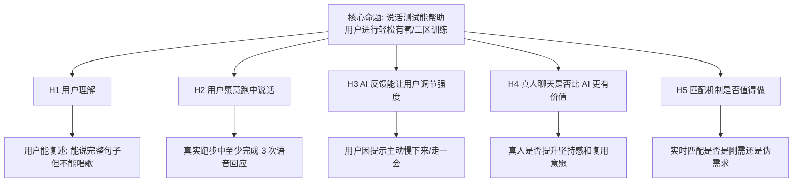
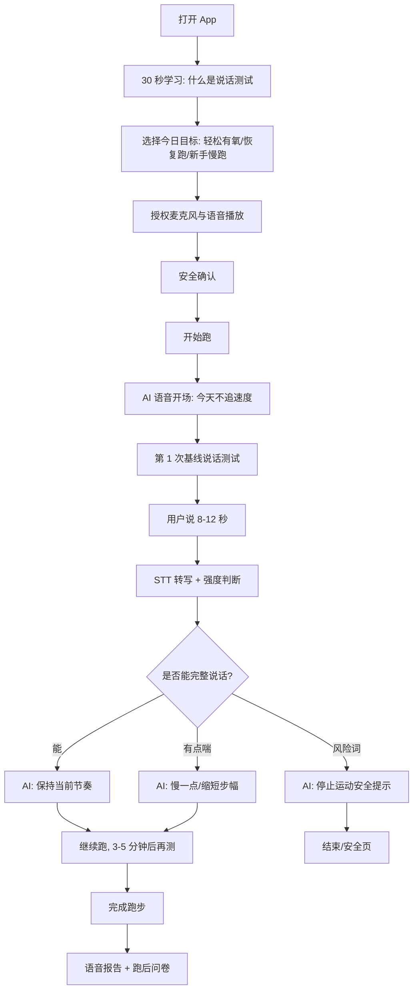

# 跑步聊天 MVP v0.2 二区说话测试假设验证

> 创建日期: 2026-06-15  
> 版本定位: v0.2 语音优先 / 二区说话测试验证版  
> 上一版本结论: v0.1 是点击式流程原型，只能验证安装、页面流和基础数据链路，不能验证核心产品假设  
> 本版本目标: 验证“跑步时通过说话测试和语音反馈，能否帮助用户理解并保持轻松有氧/二区训练强度”

---

## 1. 一句话结论

v0.2 的核心不是“跑步聊天”，也不是“找人聊天”，而是：

> 用户在跑步时必须开口说话；系统通过结构化说话测试，让用户知道自己是否处在轻松可持续的有氧强度，并在过喘时提醒他慢下来。

所以本版本要验证的是假设，不是堆功能：

```text
如果用户能在跑步时完成完整句子的说话测试，
并且 AI 能基于用户说话状态给出及时反馈，
那么用户会更容易理解和执行二区/轻松有氧训练。
```

---

## 2. 背景依据与产品边界

### 2.1 运动知识基线

本产品不做医疗诊断，也不承诺精准判定个人心率二区；v0.2 使用“说话测试”作为轻量、可理解、可执行的强度判断方法。

可采用的公开健康/运动知识基线：

| 来源 | 对本产品的启发 |
| --- | --- |
| CDC: How to Measure Physical Activity Intensity | 中等强度有氧活动的经验规则是“可以说话但不能唱歌”；高强度活动通常“说不了几句话就要停下来喘气”。 |
| American Heart Association: Target Heart Rates Chart | 中等强度活动常用 50%-70% 最大心率作为一般参考，但个体差异、药物和健康状况会影响心率区间。 |
| Mayo Clinic: Exercise intensity | 中等强度的体感特征包括呼吸加快但不至于喘不过气、可以说话但不能唱歌；过度用力时应降低强度。 |
| AktivTalk 论文, 2026 | 已有研究原型探索用手机语音数字化 Talk Test，并从说话样本中分类运动强度，说明“语音化说话测试”有产品研究价值。 |

参考链接：

- https://www.cdc.gov/physical-activity-basics/measuring/index.html
- https://www.heart.org/en/healthy-living/exercise-and-physical-activity/fitness-basics/target-heart-rates
- https://www.mayoclinic.org/healthy-lifestyle/fitness/in-depth/exercise-intensity/art-20046887
- https://arxiv.org/abs/2604.20302

### 2.2 对“二区”的产品解释

用户口中的“二区训练”在运动训练里通常指轻松有氧、可持续、不会过度喘的训练区间。不同体系对 Zone 2 的心率百分比定义不完全一致，因此 v0.2 不把“精确心率二区”作为承诺，而把产品语言定义为：

```text
轻松有氧 / 二区感：
呼吸明显比静息快，但可控；
能说完整句子；
不能轻松唱歌；
跑完后感觉还可以继续，而不是被掏空。
```

用户听得懂的判定方式：

| 状态 | 说话表现 | 产品判断 | App 反馈 |
| --- | --- | --- | --- |
| 太轻松 | 可以轻松唱歌，长篇说话不影响呼吸 | 可能低于目标强度 | 可以保持，也可略微提速，但不追求快 |
| 刚好 | 能说完整句子，中间偶尔换气，不能舒服唱歌 | 目标轻松有氧区间 | 保持当前节奏 |
| 偏强 | 只能说短句，经常断句喘气 | 可能超过目标强度 | 降速、缩短步幅、走 30-60 秒 |
| 过强/风险 | 几乎说不出话，胸痛、头晕、异常心悸、恶心 | 安全风险 | 立即停止运动，必要时寻求专业帮助 |

---

## 3. MVP 要验证的核心假设

### 3.1 假设树



### 3.2 本版本优先级

| 假设 | 重要性 | v0.2 是否验证 | 验证方式 |
| --- | --- | --- | --- |
| H1 用户理解说话测试 | P0 | 必须 | 跑前 30 秒教育 + 跑后复述题 |
| H2 用户愿意跑中说话 | P0 | 必须 | 跑中语音回应次数、完成率、访谈 |
| H3 AI 提醒能改变强度 | P0 | 必须 | 过喘后是否降速/主观确认/下一轮说话改善 |
| H4 真人聊天是否更有陪伴感 | P1 | 小样本验证 | 人工安排 5-10 场真人陪跑访谈 |
| H5 实时匹配是否值得做 | P2 | 暂不开发 | 只验证需求，不做随机匹配系统 |

### 3.3 本版本不验证什么

v0.2 不验证以下事情：

- 不验证完整社交平台。
- 不验证随机真人匹配市场。
- 不验证精准心率分区算法。
- 不验证专业医疗级风险识别。
- 不验证复杂运动计划和训练周期。
- 不验证排行榜、社区和付费。

---

## 4. v0.2 产品形态

### 4.1 推荐形态：AI 说话测试优先 + 真人人工陪跑小实验

本版本建议采用“双线验证”，但开发重心放在 AI：

| 线 | 形态 | 目的 | 是否产品化 |
| --- | --- | --- | --- |
| A 线 | AI 语音说话测试 | 验证核心闭环：用户说话 -> 系统判断 -> 给反馈 | 是，做进 App |
| B 线 | 真人人工陪跑实验 | 验证真人是否明显提升陪伴感和复用意愿 | 否，先人工运营，不做匹配系统 |

为什么不一上来做真人实时匹配：

1. 真人匹配需要在线用户池，冷启动成本高。
2. 每个人的二区配速不同，很难同频跑。
3. 两个人还要话题匹配、性格匹配、时间匹配。
4. 风控、骚扰、隐私和录音合规成本高。
5. 在没有验证“跑中说话测试”本身成立前，做匹配会把问题复杂化。

因此 v0.2 的产品判断是：

```text
先用 AI 验证“说话测试是否有用”；
再用人工真人陪跑验证“真人是否比 AI 更强”；
只有当真人实验显著提升指标，才进入实时匹配产品化。
```

---

## 5. 用户流程

### 5.1 主流程



### 5.2 跑中说话测试脚本

每轮说话测试不要让用户自由尬聊，而要给明确任务：

| 时机 | AI 提问 | 用户正确输入样例 | 系统判断重点 |
| --- | --- | --- | --- |
| 0-2 分钟 | “用一句完整的话告诉我，你现在跑起来感觉怎么样。” | “我现在感觉还可以，呼吸有点快，但能完整说话。” | 能否完整句子、是否自述过喘 |
| 5 分钟 | “描述一下你现在的呼吸：轻松、刚好，还是有点喘？” | “现在刚好，可以继续，但不能再快了。” | 主观强度 |
| 10 分钟 | “说一句 10 个字以上的话，不用快，正常说就行。” | “我现在可以继续跑，腿有点热，但呼吸还稳。” | 句子长度、停顿、喘息自述 |
| 降速后 | “慢下来之后，再说一句你现在的感觉。” | “慢下来以后好多了，可以正常说话。” | 干预是否有效 |
| 结束前 | “用一句话总结这次跑步。” | “这次跑得比以前慢，但感觉更舒服。” | 价值感、复用意愿线索 |

---

## 6. 功能范围

### 6.1 P0 必须做

| 模块 | 功能 | MVP 要求 |
| --- | --- | --- |
| 二区教育 | 30 秒跑前说明 | 明确“能说完整句子但不能唱歌”的标准 |
| 麦克风权限 | 首次授权和失败提示 | 用户知道为什么要开麦 |
| TTS 语音播放 | AI 提示读出来 | 跑中用户不需要看屏幕 |
| 自动/半自动录音 | AI 提问后进入 8-12 秒录音窗口 | 主路径不依赖连续点按钮 |
| STT 转写 | 语音转文字 | 至少输出可读文本或失败原因 |
| 强度规则判断 | easy / target / breathless / risk / unknown | 先用规则和用户自述，不做医疗判断 |
| AI 反馈 | 保持、慢下来、走一会、安全停止 | 反馈必须和用户说话内容相关 |
| 语音互动报告 | 说话测试次数、完整句次数、降速提醒次数 | 报告围绕说话测试，而非按钮 |
| 跑后问卷 | 有用吗、是否愿意再用、是否更懂二区 | 用于假设验证 |
| 埋点/API | 记录语音提示、录音、转写、判断、反馈 | 为数据复盘服务 |

### 6.2 P1 可以做

| 模块 | 功能 | 目的 |
| --- | --- | --- |
| 真人人工陪跑 | 运营人工安排同一时间语音通话 | 验证真人价值，不做系统匹配 |
| 用户话题偏好 | 跑前选择轻聊天/教练/安静 | 判断聊天风格偏好 |
| 心率手动输入 | 跑后填写平均心率/手表截图 | 辅助分析，不作为主路径 |
| 语音失败 fallback | 大按钮选择“我能完整说话/我有点喘” | 保底可用，但不算核心互动 |

### 6.3 暂不做

| 暂不做 | 原因 |
| --- | --- |
| 真人随机实时匹配 | 需要供给池，且不验证最核心说话测试假设 |
| RTC 语音房 | 技术和风控复杂度高 |
| 连续后台监听 | 隐私、耗电、审核、实现风险高 |
| 自动喘息声学识别 | 研究价值高，但不是第一版必要条件 |
| 心率设备接入 | 设备兼容复杂，容易把 MVP 拉偏 |
| 社区、排行榜、配速竞赛 | 会诱导用户追速度，和轻松有氧定位冲突 |

---

## 7. 数据指标

### 7.1 核心成功指标

| 指标 | 定义 | v0.2 目标 |
| --- | --- | --- |
| 说话测试理解率 | 跑后能选对“能说完整句但不能唱歌”的用户占比 | >= 70% |
| 首次开口率 | 开始跑后至少完成 1 次语音回应 | >= 60% |
| 多轮完成率 | 完成至少 3 次语音回应 | >= 40% |
| 语音可用率 | 录音后得到可读转写或有效自述分类 | >= 75% |
| 降速反馈接受率 | 被提示慢下来后，用户确认有帮助或下一轮说话改善 | >= 50% |
| 主观有用率 | 跑后选择“有帮助/有点帮助” | >= 60% |
| 复用意愿 | 跑后选择愿意下次继续使用 | >= 50% |
| 真人需求率 | 用过 AI 后仍主动想尝试真人陪跑 | >= 25% 才进入下一阶段 |

### 7.2 关键事件

| 事件名 | 字段 | 说明 |
| --- | --- | --- |
| `zone2_education_viewed` | durationSec | 用户看了多久教育说明 |
| `mic_permission_result` | granted / denied | 麦克风授权结果 |
| `voice_prompt_played` | promptId, elapsedSec | AI 发起说话测试 |
| `voice_record_started` | promptId, elapsedSec | 录音开始 |
| `voice_record_finished` | durationMs, promptId | 录音结束 |
| `stt_completed` | transcriptLength, confidence | 转写完成 |
| `stt_failed` | reason | 转写失败 |
| `talk_test_classified` | target / too_easy / breathless / risk / unknown | 强度判断结果 |
| `coach_voice_feedback_played` | feedbackType | AI 播放反馈 |
| `slowdown_cue_accepted` | yes / no / unknown | 用户是否接受降速建议 |
| `manual_fallback_used` | fallbackType | 语音失败时是否用了按钮兜底 |
| `post_run_zone2_quiz_answered` | correct / incorrect | 跑后理解题 |
| `human_companion_interest` | yes / maybe / no | 真人陪跑兴趣 |

---

## 8. 真人聊天验证策略

真人不是 v0.2 的主开发对象，但必须作为研究问题保留。

### 8.1 本版本真人实验方式

采用“人工礼宾式验证”，不做系统匹配：

1. 招募 5-10 名种子用户。
2. 每人先完成 2 次 AI 说话测试跑。
3. 再人工安排 1 次真人语音陪跑。
4. 真人陪跑员按同一套说话测试脚本执行，不自由闲聊到底。
5. 跑后比较：AI 是否够用，真人是否明显更有坚持感。

### 8.2 进入真人匹配产品化的门槛

只有同时满足以下条件，才进入 v0.3 真人匹配：

- AI 说话测试已经被证明有用：主观有用率 >= 60%。
- 真人陪跑比 AI 显著提升复用意愿：提升 >= 20 个百分点。
- 用户愿意为真人陪跑付出等待/预约成本。
- 运营上能稳定找到陪跑供给。
- 风控、隐私和安全边界可以被接受。

---

## 9. 验收标准

v0.2 只有满足以下标准，才算真正 MVP 通过：

1. 用户不靠跑中体感按钮，也能完成一次核心跑步流程。
2. 每次跑至少触发 3 次说话测试。
3. 用户必须说话，系统必须记录语音事件和转写/失败结果。
4. AI 反馈必须和用户说话内容有关。
5. 用户说“有点喘/说不完整/太累”时，系统必须建议慢下来。
6. 用户说“胸痛/头晕/心悸/恶心”等风险词时，系统必须进入安全兜底提示。
7. 跑后报告必须展示说话测试，而不是按钮统计。
8. 跑后问卷必须回答“是否更理解二区/轻松有氧”。

不通过条件：

- 继续以按钮反馈作为主路径。
- 用户不说话也能被算作核心互动完成。
- 报告仍然只统计“轻松/有点喘/太累”按钮。
- AI 回应和用户语音内容无关。
- 语音失败后没有提示或兜底。

---

## 10. 版本结论

v0.2 的产品判断应该非常克制：

```text
先证明“边跑边说话测试”成立，
再讨论“跟谁说话”；
先证明 AI 能帮助用户控制强度，
再讨论真人匹配是否值得做。
```

因此本版本的开发优先级是：

1. 二区说话测试教育。
2. 跑中语音输入输出。
3. 基于说话内容的强度反馈。
4. 语音互动数据和报告。
5. 真人人工陪跑小样本研究。

只有这条链路跑通，后续做真人匹配、社交、心率设备和商业化才有意义。
