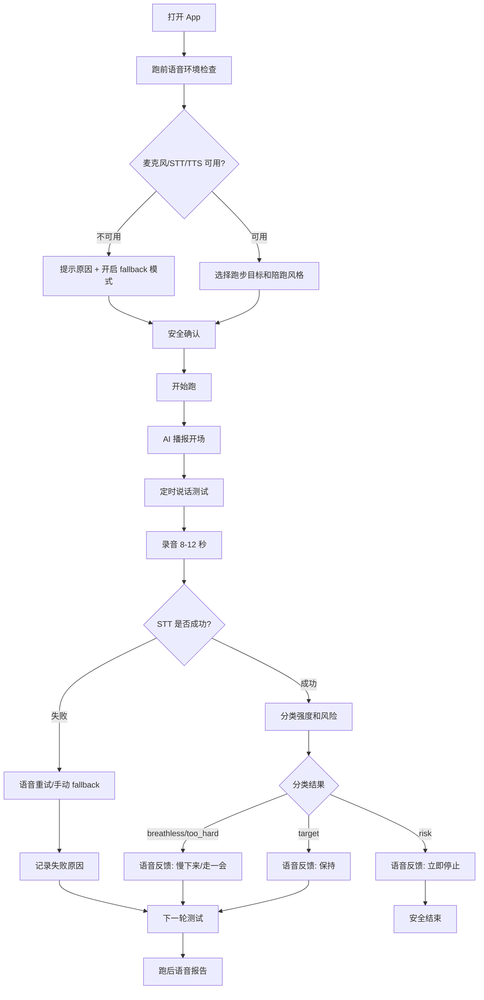

# 跑步聊天 MVP v0.3 语音实跑能力规划

> 创建日期: 2026-06-16  
> 版本定位: v0.3 真实跑步语音体验硬化版  
> 上一版本基线: v0.2 已具备 TTS 提示、STT 转写、说话测试分类、语音统计和 mock speech 测试能力  
> 本版本目标: 让用户在真实跑步中尽量不看屏幕，也能通过耳机完成多轮说话测试并获得可靠反馈

---

## 1. 一句话结论

v0.3 的核心不是增加更多页面，而是把 v0.2 的语音链路从“功能可跑通”推进到“真实跑步可复用”：

```text
用户戴着耳机开始跑后，App 能稳定播报、听取 8-12 秒说话测试、完成分类反馈；
即使语音失败，也能安全降级，不让用户在跑步中被迫盯屏或反复点按钮。
```

---

## 2. v0.2 到 v0.3 的升级边界

### 2.1 当前已具备

| 能力 | 当前状态 | v0.3 判断 |
| --- | --- | --- |
| 跑前说话测试教育 | 已有 | 保留，补充耳机/权限检查 |
| TTS 语音播报 | 已接入 `expo-speech` | 需要做播报队列、打断和耳机体验验证 |
| STT 语音识别 | 已接入 `expo-speech-recognition` | 需要做权限预检、失败恢复和真机兼容策略 |
| 规则分类器 | 已在 shared 包实现 | 需要扩充样例、减少误判、增加置信度解释 |
| mock speech | 已支持环境开关 | 需要进入 CI/E2E 稳定测试路径 |
| 报告和指标 | 已围绕 voice stats 改造 | 需要补充语音链路失败原因和漏斗指标 |

### 2.2 v0.3 不解决的问题

| 不做 | 原因 |
| --- | --- |
| 真人随机匹配 | 仍需先证明 AI 说话测试可复用 |
| 连续后台监听 | 隐私、耗电和审核风险高，不是当前 MVP 必需 |
| 医疗级喘息/心率判断 | 产品定位仍是陪伴和强度提醒，不做诊断 |
| 完整训练计划 | 会把目标从“说话测试验证”拉偏 |
| 社区、排行榜、竞速 | 与轻松有氧定位冲突 |

---

## 3. 核心用户场景

### 3.1 主场景：戴耳机户外轻松跑

用户在户外或操场跑步，手机可能放在臂包/口袋里。用户希望：

1. 跑前确认麦克风、语音识别和耳机播报可用。
2. 开始后主要听 AI 语音，不需要盯着屏幕。
3. AI 定时发起说话测试。
4. 用户正常说一句话，App 自动完成转写和分类。
5. AI 用语音反馈“保持 / 慢一点 / 走一会 / 停止运动”。
6. 语音失败时，App 用最少交互恢复或降级。

### 3.2 次场景：室内跑步机

噪声环境相对可控，但用户可能把手机放在跑步机架上。重点验证：

- 外放或耳机播报是否清楚。
- 跑步机噪声是否影响 STT。
- 用户是否能在不中断跑步的情况下完成说话测试。

### 3.3 保底场景：语音不可用

如果系统权限、设备或网络导致 STT 不可用，产品仍应：

- 明确告诉用户当前不能自动识别。
- 保留手动反馈按钮作为 fallback。
- 不把 fallback 误算为“有效语音说话测试”。
- 在报告中明确标记语音失败原因。

---

## 4. 目标指标

| 指标 | 定义 | v0.3 目标 |
| --- | --- | --- |
| 语音链路启动成功率 | 开始跑后能完成 TTS 播报和录音窗口启动的 session 占比 | >= 85% |
| 首轮有效转写率 | 第 1 次说话测试得到非空转写的 session 占比 | >= 70% |
| 三轮语音完成率 | 一次跑中完成至少 3 轮有效说话测试 | >= 45% |
| 语音失败可恢复率 | STT 失败后通过重试或 fallback 继续完成流程 | >= 80% |
| 跑中低看屏率 | 用户主观反馈“不需要频繁看屏幕” | >= 60% |
| 安全兜底触发正确率 | 风险词样例触发安全停止提示 | 自动化用例 100% |
| v0.3 复用意愿 | 用户愿意下次继续用语音跑 | >= 55% |

---

## 5. 产品流程



---

## 6. 功能范围

### 6.1 P0 必须做

| 模块 | 功能 | 验收标准 |
| --- | --- | --- |
| 跑前语音环境检查 | 检查麦克风、STT 可用性、TTS 播报 | 用户开始跑前知道语音链路是否可用 |
| 语音状态机硬化 | 明确 `speaking/listening/classifying/retry/fallback` 状态 | 任意状态失败都有下一步 |
| 播报队列 | 避免多个 TTS 提示互相打断 | 跑中不会出现重叠播报 |
| STT 失败恢复 | 超时、空文本、权限失败、识别错误分别处理 | 不会卡死在 listening/retry |
| 语音事件漏斗 | 记录 prompt、record、stt、classification、feedback、fallback | 运营看板能定位掉点 |
| 强度分类测试集 | 扩充普通话样例和风险词样例 | 分类器单测覆盖 v0.3 样例 |
| mock voice E2E | 用固定转写跑完整流程 | CI 或本地命令可稳定复现 |
| 跑后失败原因报告 | 展示语音失败次数和原因 | 内测时能判断是产品问题还是环境问题 |

### 6.2 P1 可以做

| 模块 | 功能 | 目的 |
| --- | --- | --- |
| 耳机友好提示 | 更短、更明确的 TTS 文案 | 降低跑中认知负担 |
| 手动“我说完了”按钮 | 用户提前结束录音窗口 | 提升可控感 |
| 离线/弱网说明 | 告知当前 STT 可能受影响 | 降低误解 |
| 跑后音频体验反馈 | 问“听得清吗 / 识别准吗” | 指导下一版优化 |

### 6.3 P2 暂缓

| 模块 | 原因 |
| --- | --- |
| 自动识别耳机类型 | MVP 阶段先靠人工测试记录 |
| 多语言识别 | 当前内测先聚焦中文普通话 |
| 长时间后台语音伴跑 | 需要进一步评估平台限制和合规 |

---

## 7. 技术方案预研结论

### 7.1 前端语音链路

当前继续使用 Expo 生态：

- TTS: `expo-speech`
- STT: `expo-speech-recognition`
- 音频/录音能力: `expo-audio`

v0.3 不急于替换供应商，先把状态机、失败恢复和真机测试补齐。只有当真机数据显示 STT 可用率低于目标，再评估云端 ASR 或原生插件方案。

### 7.2 后端和数据

后端继续保持轻量内测服务，但需要把语音事件从“能存”升级为“能分析”：

- 每轮说话测试要有 `roundId`。
- 每个 round 记录 prompt -> record -> stt -> classification -> feedback 的状态。
- 失败原因需要结构化，不能只存一段错误文本。
- 管理指标需要能按 session 看语音漏斗。

### 7.3 自动化测试

v0.3 的自动化重点不是测试真实麦克风，而是测试确定性逻辑：

- 分类器规则和风险词。
- 语音状态机转换。
- mock transcript 驱动的跑中流程。
- API 语音事件统计。

真实麦克风、耳机和噪声只能通过真机测试矩阵验证。

---

## 8. 多角色评审

### 产品经理评审

- 通过点: v0.3 聚焦“真实跑步语音可用”，没有过早扩展真人匹配和社区。
- 风险: 如果 v0.2 尚未完成足够真实跑步样本，v0.3 的优化优先级可能缺少数据依据。
- 建议: 每个语音失败场景都要能回到“安全完成一次跑”的主目标。

### 研发工程师评审

- 通过点: 继续使用现有 Expo 语音能力，避免过早引入复杂原生工程。
- 风险: 移动端 TTS、STT、录音生命周期可能受 App 前后台、权限和设备差异影响。
- 建议: 先建立语音状态机单测和事件漏斗，再做真机兼容优化。

### 测试工程师评审

- 通过点: 已把 mock speech 和真机语音测试分层，避免 CI 依赖真实设备。
- 风险: 耳机、外放、跑步机噪声、户外风噪都可能影响结果。
- 建议: 建立 Android 真机测试矩阵：外放、蓝牙耳机、有线耳机、室内跑步机、户外慢跑。

### UI/UX 评审

- 通过点: 强调低看屏和语音优先，符合跑步场景。
- 风险: 跑中提示过长会打扰呼吸节奏。
- 建议: v0.3 文案控制在 3-6 秒，可把长解释留在跑前页。

### 运维/运营评审

- 通过点: 语音漏斗能帮助定位“用户不愿说”还是“技术没识别”。
- 风险: 如果只看完成率，不看失败原因，会误判产品假设。
- 建议: 内测报告至少拆分为设备问题、权限问题、识别问题、用户主动放弃四类。

---

## 9. v0.3 进入开发的前置条件

1. v0.2 当前代码保持自动测试通过。
2. GitHub Actions 基础 CI 已启用，保护主分支质量。
3. v0.3 任务清单冻结 P0 范围，不把真人匹配放进本版本。
4. 至少准备 3 台 Android 环境或等价测试组合：模拟器、真机外放、真机耳机。

---

## 10. v0.3 完成定义

### 工程完成

- CI 自动跑通 typecheck 和单元测试。
- 语音状态机核心路径有单测。
- mock transcript 能跑通 E2E 主流程。
- Android 真机能完成至少 3 轮说话测试。
- 语音失败不会卡死流程。

### 产品验证完成

- 10-20 次真实跑步样本中，三轮语音完成率达到或接近 45%。
- 用户能说清“我为什么要慢下来”。
- 用户主观认为跑中不需要频繁看屏。
- 形成是否进入 v0.4 的明确判断：继续语音硬化、转真人陪跑实验，或收缩范围。
