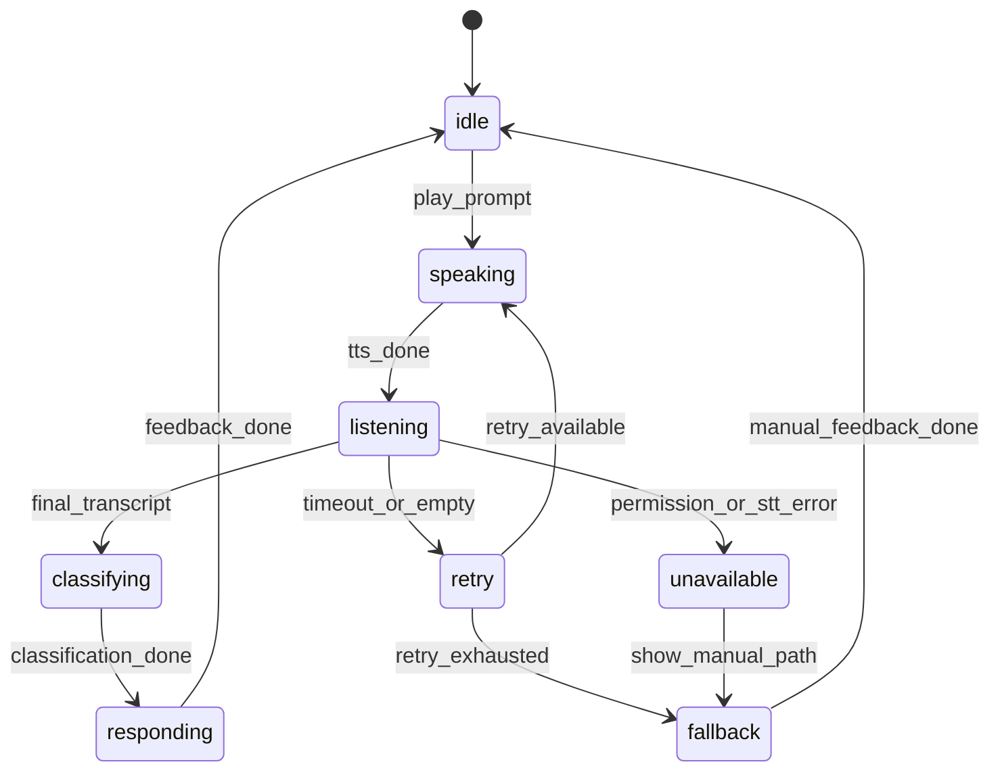

# 跑步聊天 MVP v0.3 开发任务清单

> 创建日期: 2026-06-16  
> 版本目标: 把 v0.2 语音说话测试从“能跑通”升级为“真实跑步时稳定可用”  
> 相关文档: `09-MVP-v0.3语音实跑能力规划.md`

---

## 1. 版本范围

### 1.1 v0.3 必须交付

1. GitHub Actions 自动跑 `npm ci`、`npm run typecheck`、`npm test`。
2. 跑前完成语音环境检查，让用户知道 TTS/STT/麦克风是否可用。
3. 跑中语音状态机不会卡死，失败时能重试或降级。
4. TTS 播报不重叠、不连续打断用户。
5. STT 失败原因可记录、可统计、可在报告中解释。
6. mock transcript 能支撑稳定自动化测试。
7. Android 真机完成至少 3 轮说话测试。
8. 内测能区分“用户不愿说话”和“技术链路不可用”。

### 1.2 v0.3 不交付

- 不做真人随机匹配。
- 不做 RTC 语音房。
- 不做完整后台连续监听。
- 不做医疗级喘息声学识别。
- 不做心率设备接入。
- 不做社区、排行榜和训练计划。

---

## 2. Milestone 规划

| Milestone | 名称 | 目标 | 建议周期 | 通过标准 |
| --- | --- | --- | --- | --- |
| V03-M0 | CI 和质量门禁 | 每次 push/PR 自动校验 | 0.5 天 | GitHub Actions 能跑通 typecheck/test |
| V03-M1 | 语音环境预检 | 跑前知道语音能力是否可用 | 1 天 | 权限/STT/TTS 状态有明确提示 |
| V03-M2 | 跑中语音状态机硬化 | 防止卡死、重叠播报和失败无出口 | 1-2 天 | 状态机单测覆盖核心转换 |
| V03-M3 | 事件漏斗和报告 | 能定位每轮语音掉点原因 | 1 天 | 管理指标能看到 prompt->feedback 漏斗 |
| V03-M4 | 自动化和真机测试 | mock 自动化 + Android 真机矩阵 | 1-2 天 | 真机完成 3 轮说话测试 |
| V03-M5 | 小样本复盘 | 得到 v0.4 决策依据 | 1 周 | 输出语音可用率和复用意愿结论 |

---

## 3. 任务拆解

### V03-M0: CI 和质量门禁

| ID | 任务 | 负责人 | 优先级 | 产出 | 验收标准 |
| --- | --- | --- | --- | --- | --- |
| V03-M0-T01 | 新增 GitHub Actions CI | 研发 | P0 | `.github/workflows/ci.yml` | push/PR 到 `main` 自动运行 |
| V03-M0-T02 | 使用 `.node-version` 安装 Node | 研发 | P0 | setup-node 配置 | CI 使用仓库约定 Node 版本 |
| V03-M0-T03 | 跑 workspace typecheck | 研发 | P0 | `npm run typecheck` | API、mobile、shared 类型检查通过 |
| V03-M0-T04 | 跑 workspace test | 研发 | P0 | `npm test` | 单元测试通过 |
| V03-M0-T05 | 暂缓默认 E2E | 研发+QA | P1 | 文档说明 | E2E 作为后续独立工作流或手动门禁 |

### V03-M1: 跑前语音环境预检

| ID | 任务 | 负责人 | 优先级 | 产出 | 验收标准 |
| --- | --- | --- | --- | --- | --- |
| V03-M1-T01 | 设计语音环境检查 UI | 产品+UI | P0 | 跑前检查区块 | 用户看到麦克风、语音识别、播报状态 |
| V03-M1-T02 | 麦克风权限预检 | 移动端 | P0 | 权限检查函数 | 拒绝后给出开启权限指引 |
| V03-M1-T03 | STT 可用性预检 | 移动端 | P0 | `isRecognitionAvailable` 检查 | 不可用时进入 fallback 模式 |
| V03-M1-T04 | TTS 播报试听 | 移动端 | P0 | “播放测试提示”按钮 | 用户能确认耳机/外放听得见 |
| V03-M1-T05 | 预检结果埋点 | 移动端+API | P1 | `voice_preflight_completed` 事件 | 能统计失败类型 |

### V03-M2: 跑中语音状态机硬化

| ID | 任务 | 负责人 | 优先级 | 产出 | 验收标准 |
| --- | --- | --- | --- | --- | --- |
| V03-M2-T01 | 抽离语音状态机 | 移动端 | P0 | `voiceSessionMachine` 或等价模块 | UI 不直接散落处理所有状态 |
| V03-M2-T02 | 增加 TTS 播报队列 | 移动端 | P0 | `speakCoachLine` 队列/锁 | 不出现两个提示同时播放 |
| V03-M2-T03 | 录音窗口超时处理 | 移动端 | P0 | listening 超时策略 | 超时后进入 retry/fallback |
| V03-M2-T04 | 空文本处理 | 移动端 | P0 | STT 空文本逻辑 | 空文本不计入有效说话测试 |
| V03-M2-T05 | 重试次数上限 | 移动端 | P0 | retry policy | 连续失败后进入 fallback，不无限循环 |
| V03-M2-T06 | 手动 fallback 不混淆指标 | 移动端+API | P0 | fallback 事件字段 | 报告区分语音完成和手动完成 |
| V03-M2-T07 | 状态机单元测试 | QA/研发 | P0 | 测试用例 | 覆盖 start、success、stt_failed、timeout、fallback |

### V03-M3: 事件漏斗和报告

| ID | 任务 | 负责人 | 优先级 | 产出 | 验收标准 |
| --- | --- | --- | --- | --- | --- |
| V03-M3-T01 | 增加语音 roundId | shared+移动端+API | P0 | `roundId` 字段 | 每轮 prompt/record/stt/classification 可串起来 |
| V03-M3-T02 | 结构化失败原因 | shared+移动端+API | P0 | `permission_denied/unavailable/timeout/empty/error` | 失败原因可聚合 |
| V03-M3-T03 | API 统计语音漏斗 | 后端 | P0 | 报告/metrics 字段 | 能看每轮掉在哪一步 |
| V03-M3-T04 | 报告页展示语音可靠性 | 移动端 | P1 | 语音体验摘要 | 用户看到识别成功/失败次数 |
| V03-M3-T05 | 管理页展示 v0.3 指标 | 移动端+后端 | P1 | 管理看板区块 | 能看启动成功率、首轮转写率、三轮完成率 |

### V03-M4: 自动化和真机测试

| ID | 任务 | 负责人 | 优先级 | 产出 | 验收标准 |
| --- | --- | --- | --- | --- | --- |
| V03-M4-T01 | 扩充分类型器测试集 | QA/研发 | P0 | shared 单测 | 覆盖普通话、短句、风险词、否定表达 |
| V03-M4-T02 | mock transcript E2E | QA/研发 | P0 | Playwright 或等价测试 | 固定转写能生成正确报告 |
| V03-M4-T03 | Android 外放测试 | QA | P0 | 测试记录 | 完成 3 轮说话测试 |
| V03-M4-T04 | Android 蓝牙耳机测试 | QA | P0 | 测试记录 | 播报可听清，STT 可得到文本 |
| V03-M4-T05 | 室内跑步机噪声测试 | QA | P1 | 测试记录 | 记录失败率和主观体验 |
| V03-M4-T06 | 户外慢跑测试 | QA/产品 | P1 | 测试记录 | 验证低看屏体验 |
| V03-M4-T07 | 更新 APK 测试用例 | QA | P0 | `APK_TEST_CASES_v0.3.md` | 包含预检、失败恢复、耳机场景 |

### V03-M5: 小样本复盘

| ID | 任务 | 负责人 | 优先级 | 产出 | 验收标准 |
| --- | --- | --- | --- | --- | --- |
| V03-M5-T01 | 招募 10-20 次真实跑样本 | 运营 | P0 | 测试名单 | 覆盖至少 2 种设备/耳机组合 |
| V03-M5-T02 | 收集跑后语音体验反馈 | 产品 | P0 | 反馈表 | 听得清、识别准、是否少看屏 |
| V03-M5-T03 | 分析语音漏斗 | 产品+研发 | P0 | 数据复盘 | 区分用户意愿问题和技术问题 |
| V03-M5-T04 | 输出 v0.4 决策 | 产品 | P0 | 复盘报告 | 明确继续语音硬化 / 真人实验 / 收缩范围 |

---

## 4. 技术实现建议

### 4.1 语音状态机建议

### 4.2 事件字段建议

| 字段 | 类型 | 说明 |
| --- | --- | --- |
| `roundId` | string | 一轮说话测试唯一 ID |
| `promptId` | string | 脚本 ID |
| `voiceState` | string | 当前语音状态 |
| `failureReason` | string | 失败原因枚举 |
| `durationMs` | number | 录音/识别耗时 |
| `transcriptLength` | number | 转写长度，不存敏感长文本到指标 |
| `classification` | string | `target/breathless/too_hard/risk/unknown` |
| `usedFallback` | boolean | 是否手动兜底 |

---

## 5. v0.3 验收用例速查

| 用例 | 前置条件 | 操作 | 预期 |
| --- | --- | --- | --- |
| CI 自动测试 | push 到 main | 等待 GitHub Actions | typecheck/test 通过 |
| 语音预检成功 | 麦克风和 STT 可用 | 播放试听并开始跑 | 进入语音主流程 |
| 麦克风拒绝 | 系统拒绝权限 | 开始跑前预检 | 显示原因并进入 fallback |
| TTS 不重叠 | 连续触发多个提示 | 跑中等待播报 | 提示排队或安全打断，不重叠 |
| STT 空文本 | mock 返回空文本 | 完成一轮说话测试 | 进入 retry，不计有效轮次 |
| 连续 STT 失败 | mock 连续失败 | 跑中重试 | 达上限后进入 fallback |
| 风险词 | “我有点胸痛头晕” | 完成转写 | 分类 `risk`，播放停止运动提示 |
| 三轮完成 | mock 三段有效转写 | 跑完并查看报告 | 有效说话测试数 >= 3 |

---

## 6. 推荐开发顺序

1. 保持 CI 先跑通，所有后续改动都经过 typecheck/test。
2. 抽离语音状态机和单测，不先改 UI 大结构。
3. 补预检和失败恢复，把“不可用”变成可解释状态。
4. 扩展事件和报告，保证内测数据可复盘。
5. 做 mock transcript E2E。
6. 最后做 Android 真机矩阵和 v0.3 APK。
